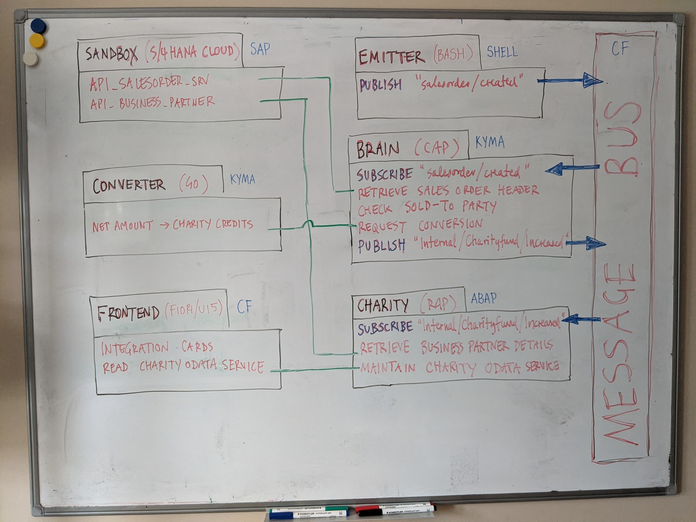

# SAP TechEd 2020 Developer Keynote

This is the repository containing all the source (code, configuration and more) that was put together by the SAP Developer Advocates team for the Developer Keynote (DK100) at SAP TechEd 2020.

## Description

The Developer Keynote session is designed to show how developers of different backgrounds, using different tools, technologies and languages can come together and contribute collectively towards an extension to an SAP S/4HANA Cloud system, using SAP Cloud Platform and services & runtimes upon it.

You can find out more about the back story for this keynote in the blog post [SAP TechEd Developer Keynote DK100 - The Story](https://blogs.sap.com/2020/11/19/sap-teched-developer-keynote-dk100-the-story/).

The layout of this repository generally reflects the different components shown on the whiteboard diagram and demonstrated throughout the session.

You can study and experiment with each component individually, and they are of course all designed to work together as shown in the developer keynote itself. Each component has its own directory within this repository.

We recommend you take the components one at a time. Specific instructions are given for each component, in the respective README files. Here's a list of those components, with links to their directories (and the READMEs):

- [SANDBOX](s4hana/sandbox/) - the proxy app that sits in front of the SAP Business API Hub sandbox system and injects the API key into each request as it passes through (JavaScript app using the `@sap/approuter` package)

- [EMITTER](s4hana/event/) - the script that generates and emits (publishes) a "salesorder/created" event message to the message bus (Bash shell script invoking Messaging API calls to the SAP Enterprise Messaging service instance)

- [CONVERTER](kyma/) - the converter service that translates net amounts into charity credit amounts (Go language service listening for incoming HTTP requests)

- [BRAIN](cap/brain/) - the service that coordinates the event messages, subscriber to the "salesorder/created" topic, and publisher of event messages to the "Internal/Charityfund/Increased" topic (a Node.js CAP based service connected to various endpoints)

- [FRONTEND](ui/) - the web dashboard that visualizes the data from the CHARITY component (an SAPUI5 / Fiori app using UI Integration Cards)

- [CHARITY](abap/src/) - the charity backend service that receives event messages published to the "Internal/Charityfund/Increased" topic, stores the data, retrieves business partner info, and makes an OData service available for the FRONTEND component (a Steampunk ABAP stack RAP based service)

## Requirements

## Download and Installation

## Known Issues

## How to obtain support

## Contributing

## License

Copyright (c) 2020 SAP SE or an SAP affiliate company. All rights reserved. This project is licensed under the Apache Software License, version 2.0 except as noted otherwise in the [LICENSE](LICENSES/Apache-2.0.txt) file.
