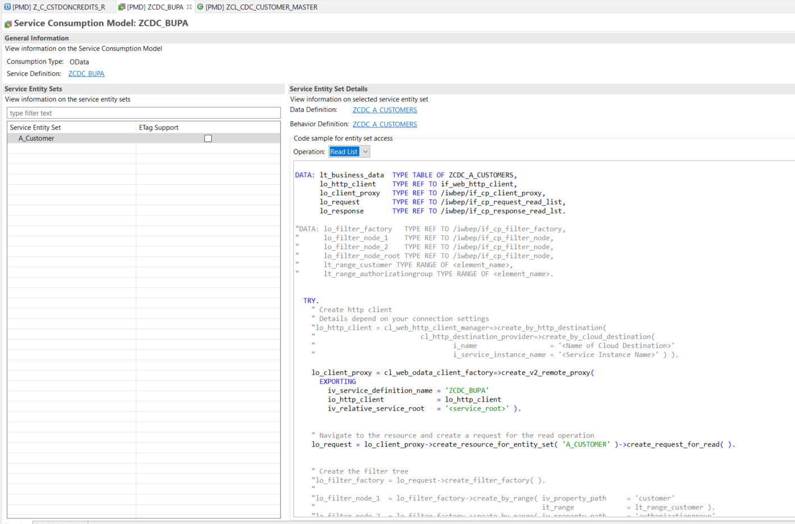

# CHARITY

The Charity component is the ABAP layer of the application and it has two responsibilities. First, it handles the message coming in from Enterprise Messaging and updates our custom table in our Steampunk system.  Secondly, it exposes the data in our custom table via an OData service leveraging the ABAP RESTful Application Programming(RAP) model.

## Overview

The context in which it runs is shown as the highlighted section of the whiteboard:


The first task of the Charity componet is to handle the incoming message from the webhook subscription in Enterprise Messaging. The webhook subscription is configured to trigger a request to the HTTP Service(ZCDC_REST_SERVICE) endpoint URL in the Steampunk system.  The ABAP handler class called ZCL_CDC_REST_SERVICE is the class which implements the methods for the endpoint.  


The ABAP HTTP handler class which is tied to this endpoint URL expects a certain payload containing the relevant data. 

```json
{
    "data": {
        "data": {
            "specversion": "1.0",
            "type": "z.internal.charityfund.increased.v1",
            "datacontenttype": "application/json",
            "id": "4c8f6699-f08f-4a3b-8fd6-0b4f26687091",
            "time": "2020-10-02T13:51:30.888Z",
            "source": "/default/cap.brain/1",
            "data": {
                "salesorder": "1234567",
                "custid": "USCU-CUS10",
                "creationdate": "2020-10-02",
                "credits": 2.27,
                "salesorg": "1720"
            }
        }
    }
}

```
A Post method to the http service endpoint is triggered by Enterprise Messaging for this webhook subscription which contains this payload. The ABAP handler class then deseralizes this json payload into ABAP structures and updates the custom table accordingly.

```abap
* Convert payload json to abap structures
        /ui2/cl_json=>deserialize( EXPORTING json = request->get_text(  )
                                             pretty_name = /ui2/cl_json=>pretty_mode-low_case
                                    CHANGING data = ls_payload ).

* Update table with data
        MODIFY zcstdoncredits FROM @ls_payload-data-data-data.
        IF sy-subrc = 0.
          response->set_status( i_code = 200 i_reason = 'Ok').
          response->set_text( | Database table updated successfully for customer number { ls_payload-data-data-data-custid } | ).
        ELSE.
          response->set_status( i_code = 500 i_reason = 'Error').
          response->set_text( 'Error occured when updating database table' ).
        ENDIF.
```


The data has now flowed to the custom table, it can now be exposed to the user interface via an OData service provided by the ABAP RESTful Application Programming model framework. For this we hav several views, a lowest level business object interface view, Z_I_CSTDONCREDITS and a reporting view on top of it called Z_I_CSTDONCREDITS_R.  On top of the interface views are the consumption views, Z_C_CSTDONCREDITS and Z_C_CSTDONCREDITS_R.  


The Z_C_CSTDONCREDITS_R view is the view which is exposed and consumed by the user interface. It contains the relevant data, including the virtual ele3ment "Customer Name" which is being pulled in from the source S/4HANA system at runtime via the Service Consumption Model object called ZCDC_BUPA.

```@EndUserText.label: 'Customer Donation Credits - Reporting'
@AccessControl.authorizationCheck: #CHECK
@Metadata.allowExtensions: true
define root view entity Z_C_CSTDONCREDITS_R as projection on Z_I_CSTDONCREDITS_R {
    //Z_I_CSTDONCREDITS_R
    key custid,
    key creationdateyyyymm,
    @ObjectModel.virtualElementCalculatedBy: 'ABAP:ZCL_CDC_CUSTOMER_MASTER'
    @EndUserText.label : 'Customer Name'    virtual customername : abap.char(40),
    totalcredits
}
```

The virtual element for "Customer Name" is implemented in class ZCL_CDC_CUSTOMER_MASTER.  In this class, we leverage a code snippet from the Service Consumption Model for reading all entites.




## Prerequisites

* You have downloaded and installed ABAP Development Tools (ADT). Make sure to use the most recent version as indicated on the installation page.
* You have created an ABAP Cloud Project in ADT that allows you to access your SAP Cloud Platform ABAP Environment instance (see here for additional information). Your log-on language is English.
* You have installed the abapGit plug-in for ADT from the update site http://eclipse.abapgit.org/updatesite/.

## Installation & Configuration

Once you have installed the abapGit plug-in for ADT, you can now clone this repo to your ABAP system and create the required ABAP Objects.  

Currently abapGit does not handle the creation of the HTTP service, so you will need to create that manually and configure that service to point to the handler class ZCL_CDC_REST_SERVICE.


