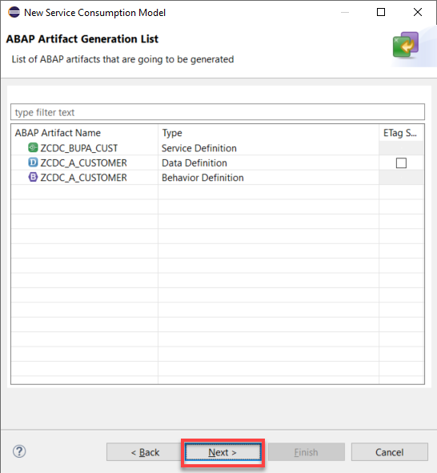

# CHARITY

The Charity component is the ABAP layer of the application and it has two responsibilities. First, it handles the message coming in from Enterprise Messaging and updates our custom table in our ABAP system.  Secondly, it exposes the data in our custom table via an OData service leveraging the ABAP RESTful Application Programming(RAP) model.

## Overview

The context in which it runs is shown as the highlighted section of the whiteboard:


## HTTP Service & Handler Class

The first task of the Charity componet is to handle the incoming message from the webhook subscription in Enterprise Messaging. The webhook subscription is configured to trigger a request to the HTTP Service(ZCDC_REST_SERVICE) endpoint URL in the ABAP system.  The ABAP handler class called ZCL_CDC_REST_SERVICE is the class which implements the methods for the endpoint.  As the HTTP Service has not been imported with the abapgit project, you will need to create this service manually(see steps below).  Finally, You can use the ZCL_CDC_TRIGGER_WEBHOOK_SIM class to simulate the HTTP service being triggered by the enterprise messaging webhook. This class mocks HTTP request/response objects and calls the HANDLE_REQUEST method directly passing in the JSON payload that the EM webhook would pass.

To create this HTTP service object manually....
   
1. From your package, right-click and choose New->Other ABAP Repository Object.

    

2. Under Connectivity, choose HTTP Service, and click Next.

    

3. Enter the name of the service as ZCDC_REST_SERVICE, keep the default name for the class as ZCL_CDC_REST_SERVICE, click Next, then Finish.

    
    
4. You will now see the new service, make sure to activate.

    


The ABAP HTTP handler class which is tied to this endpoint URL expects a certain payload containing the relevant data. 

```json
{
    "data": {
        "data": {
            "specversion": "1.0",
            "type": "z.internal.charityfund.increased.v1",
            "datacontenttype": "application/json",
            "id": "4c8f6699-f08f-4a3b-8fd6-0b4f26687091",
            "time": "2020-10-02T13:51:30.888Z",
            "source": "/default/cap.brain/1",
            "data": {
                "salesorder": "1234567",
                "custid": "USCU-CUS10",
                "creationdate": "2020-10-02",
                "credits": 2.27,
                "salesorg": "1720"
            }
        }
    }
}

```
A #POST method to the http service endpoint is triggered by Enterprise Messaging for this webhook subscription which contains this payload. The ABAP handler class then deseralizes this json payload into ABAP structures and updates the custom table accordingly.

```abap
* Convert payload json to abap structures
        /ui2/cl_json=>deserialize( EXPORTING json = request->get_text(  )
                                             pretty_name = /ui2/cl_json=>pretty_mode-low_case
                                    CHANGING data = ls_payload ).

* Update table with data
        MODIFY zcstdoncredits FROM @ls_payload-data-data-data.
        IF sy-subrc = 0.
          response->set_status( i_code = 200 i_reason = 'Ok').
          response->set_text( | Database table updated successfully for customer number { ls_payload-data-data-data-custid } | ).
        ELSE.
          response->set_status( i_code = 500 i_reason = 'Error').
          response->set_text( 'Error occured when updating database table' ).
        ENDIF.
```


## Exposing the Data via CDS Views

The data has now flowed to the custom table. The second task of this component is to expose the data to the user interface via an OData service provided by the ABAP RESTful Application Programming model framework. For this there are several views, a lowest level business object interface view, Z_I_CSTDONCREDITS and a reporting view on top of it called Z_I_CSTDONCREDITS_R.  On top of the interface views are the consumption views, Z_C_CSTDONCREDITS and Z_C_CSTDONCREDITS_R.  


The Z_C_CSTDONCREDITS_R view is the view which is exposed and consumed by the user interface. It contains the relevant data, including the virtual element "Customer Name" which is pulled in from the source S/4HANA system at runtime via the Service Consumption Model object called ZCDC_BUPA_CUST.

```@EndUserText.label: 'Customer Donation Credits - Reporting'
@AccessControl.authorizationCheck: #CHECK
@Metadata.allowExtensions: true
define root view entity Z_C_CSTDONCREDITS_R as projection on Z_I_CSTDONCREDITS_R {
    //Z_I_CSTDONCREDITS_R
    key custid,
    key creationdateyyyymm,
    @ObjectModel.virtualElementCalculatedBy: 'ABAP:ZCL_CDC_CUSTOMER_MASTER'
    @EndUserText.label : 'Customer Name'    virtual customername : abap.char(40),
    totalcredits
}
```

## Leveraging the Service Consumption Model

The virtual element for "Customer Name" is implemented in ABAP class ZCL_CDC_CUSTOMER_MASTER.  In this class, leveraging a code snippet from the Service Consumption Model for reading all entites, all customer names are pulled in and incorporated with the rest of the data in the Z table.

As the Service Consumption Model object has not been imported with the abapgit project, you will need to create this  manually(see steps beelow).

To create the Service Consumption Model object manually....

1. First, make sure you have the edmx file. Go to the SAP API Hub, and download the edmx file for the Business Partner Odata Service.
    
    

2. From your package, right-click on Business Services and choose New->Service Consumption Model.
    
    

3. Name it as ZCDC_BUPA_CUST, give a description, and choose OData as the mode.  Click Next.

    

4. Click Browse, and choose the edmx file that you downloaded.

    

5. Add the prefix as CDC_ and then click Next.

    

6. Click Deselect All, then select only A_Customer, remember this generated ABAP Artifact Name for step 9.  Click Next.
    
    

7. Click Next, then Finish.

    

8. You will then see the activated service consumption model object.  

    

9. Go to the class ZCL_CDC_CUSTOMER_MASTER.  Update the data definintion for LT_BUSINESS_DATA.  Use the ABAP Artifact Name from step 6.

    

10. Update the apihub service URL here as well.

    

## Service Definitions & Service Bindings

Next, the service definitions and service bindings.  Z_SD_C_CSTDONCREDITS_R is the reporting service definition which is used in the application. Z_UI_C_CSTDONCREDITS_R is the service binding.  


You will need to make sure that the service binding is activated, and that you click on the Publish button in order to use the service.  Once published, it is possible to launch a Fiori preview application to test the service from the service binding.


## Prerequisites

* You have downloaded and installed ABAP Development Tools (ADT). Make sure to use the most recent version as indicated on the installation page.
* You have created an ABAP Cloud Project in ADT that allows you to access your SAP Cloud Platform ABAP Environment instance (see here for additional information). Your log-on language is English.
* You have installed the abapGit plug-in for ADT from the update site http://eclipse.abapgit.org/updatesite/.

## Installation & Configuration

Once you have installed the abapGit plug-in for ADT, you can now clone this repo to your ABAP system and create the required ABAP Objects.  Make sure to activate ALL imported objects before moving further.

Currently abapGit does not handle the creation of the HTTP service nor the Service Consumption Model objects, so you will need to create and configure them manually. See instructions above.


