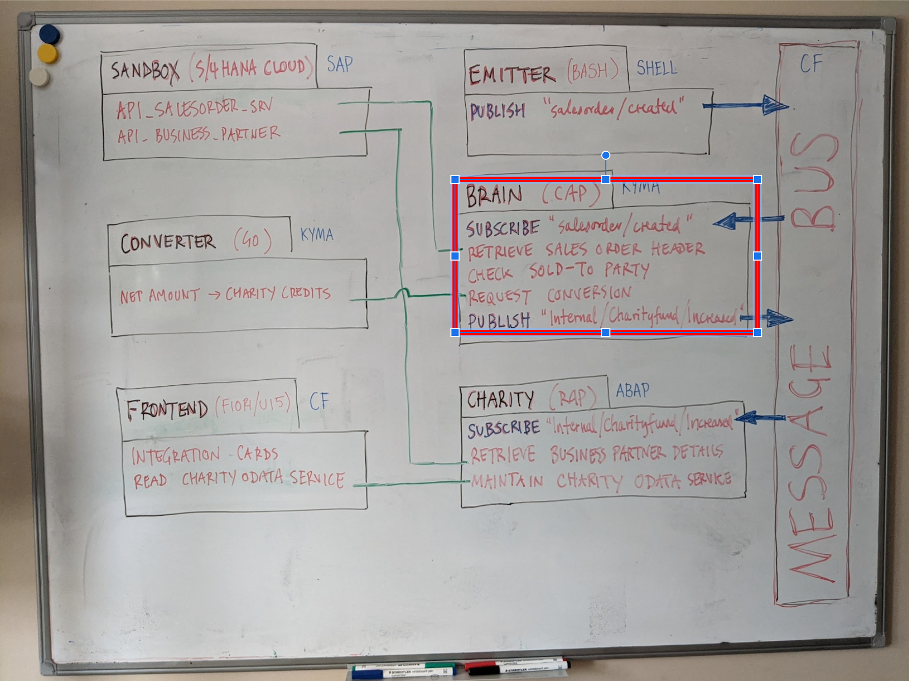
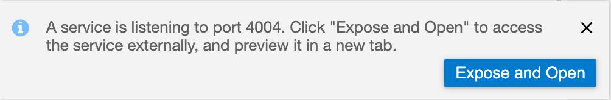
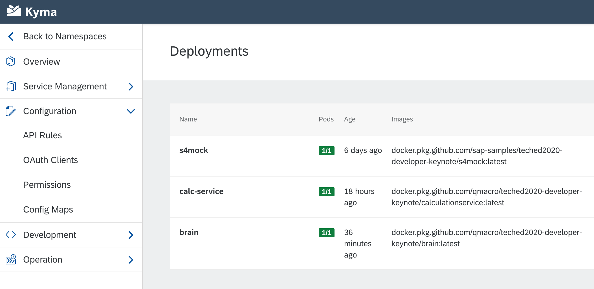

# The BRAIN component

**Contents**
- [Overview](#overview)
- [Controlling the processing](#controlling-the-processing)
- [Remote services defined and used](#remote-services-defined-and-used)
- [Setup required](#setup-required)
  - [Assumptions](#assumptions)
  - [Destinations](#destinations)
  - [Service instances](#service-instances)
  - [Local service setup](#local-service-setup)
- [Running it](#running-it)
  - [Locally](#locally)
  - [On SAP Cloud Platform - Kyma runtime](#on-sap-cloud-platform---kyma-runtime)
    - [Build & publish, secrets and deployment](#build--publish-secrets-and-deployment)
    - [Create and deploy a credentials config map](#create-and-deploy-a-credentials-config-map)
    - [Check the component is up and running](#check-the-component-is-up-and-running)    

## Overview

This section relates to BRAIN component, the service that coordinates the event messages, subscribes to the "salesorder/created" topic, and publishes event messages to the "Internal/Charityfund/Increased" topic, and is represented by the "BRAIN" block in the whiteboard diagram.



This README is quite long, but hopefully useful and interesting. Here's a small table of contents to help you navigate.

The BRAIN component is a basic CAP application with two of the three layers in use. In effect, a "service" more than an application:

|Layer|Description|
|-|-|
|`app`|Unused|
|`srv`|A single service `teched` is defined exposing an entity `CharityEntry`. Custom JavaScript code for managing the BRAIN's operations and activities|
|`db`|An entity `CharityEntry` is defined with a `SoldToParty` property as key, and a counter property. This entity is defined within the namespace `charity`|

The service, once deployed, does not require any human intervention to function. Processing follows a sequence of the following activities, each time an event published to the "salesorder/created" topic on the message bus is received; each activity is denoted by a "level" number (1 through 4):

1. Log the message details
1. Retrieve sales order header details from the OData service `API_SALES_ORDER_SRV` proxied by the SANDBOX component
1. Request a conversion of the total net amount of the sales order to the equivalent in charity fund credits, by calling the CONVERTER component\*
1. Publish a new event to the "Internal/Charityfund/Increased" topic\*

_\*This is as long as the sold-to party is one that hasn't already been processed 10 times before_

## Controlling the processing

To aid testing and gradual component deployment (getting all components up and running and connected), an enhancement has been made since the Developer Keynote presentation to allow the control of these activities using an environment variable `BRAIN_LEVEL`.

Setting this to 0 will mean that none of the above activities are carried out. Setting this to a value equivalent to one of the activity numbers (i.e. 1, 2, 3 or 4) will mean that activities up to and including that number will be carried out. The default value (if none is set explicitly) is 1, meaning the received event message will be logged, and that's all.


## Remote services defined and used

In carrying out the activities listed above, the CAP service consumes the following services which are defined in `package.json`. Some of these employ destinations defined in the cloud (on CF - see below):

|Name|Kind|Details|
|-|-|-|
|`messaging`|`enterprise-messaging`|Connection to the message bus|
|`db`|`sqlite`|Local persistence|
|`S4SalesOrders`|`odata`|Connection to the API Hub sandbox (SAP S/4HANA Cloud mock system) OData service. Destination `apihub_mock_salesorders`|
|`ConversionService`|`rest`|Connection to the Converter (Go microservice) conversion service. Destination `charityfund_converter`|

## Setup required

You'll need to set a few things up in preparation for getting this component up and running. 

### Assumptions

These instructions assume you've cloned your forked copy of this repository, as described in the [Download and installation section](../../README.md#download-and-installation) of the main repository README. The GitHub username in the examples in this README is 'qmacro' - you should replace this with your own GitHub username. 

It also assumes you've opted to use the SAP Business Application Studio (App Studio) for your development environment and have followed the setup instructions in [Using the SAP Business Application Studio](/usingappstudio/). Prompts shown in examples in this README will reflect the prompt style in the terminal of an App Studio Dev Space (showing the username, current directory, and so on).

Finally it also assumes you've already set up the message bus, an instance of the SAP Enterprise Messaging service, following the instructions in [Message bus setup](../../messagebus/).

### Destinations

As mentioned above, there are some destinations at play here. Two, in fact, pointing to:

- the `S4SalesOrders` endpoint, required for BRAIN_LEVEL 2
- the `ConversionService` endpoint, required for BRAIN_LEVEL 3

If you're just starting out, and only want to get the BRAIN component up and running at BRAIN_LEVEL 1 for now, you can leave the destinations setup until you're ready. Otherwise, set these destinations up now, following the [Destinations setup](destinations.md) instructions.

### Service instances

In addition to an instance of the SAP Enterprise Messaging service, the BRAIN component requires access to instances of another couple of services:

- the Destination service
- the Authorization & Trust Management service (otherwise known as XSUAA)

These services are to enable the reading of those two destination definitions (for the `S4SalesOrders` and `ConversionService` endpoints) that you've just created in the previous section.

Set up these services now following the [Service instances setup](serviceinstances.md) instructions.

### Local service setup

The best way to get this component up and running is to start locally. So now is a good point to set things up for local execution. This is a CAP based service, which relies on certain NPM modules (see the `dependencies` and `devDependencies` nodes in [`package.json`](package.json) and a local SQLite-powered persistence layer (see the `cds -> requires -> db` node in the same file).

First, ensure you're in this (`cap/brain/`) directory:

```bash
user: teched2020-developer-keynote $ cd cap/brain/
user: brain $ pwd
/home/user/projects/teched2020-developer-keynote/cap/brain
```

Next, get the modules installed by running `npm install`. This is the sort of thing you should see:

```
user: brain $ npm install

> @sap/hana-client@2.6.54 install /private/tmp/teched2020-developer-keynote/cap/brain/node_modules/@sap/hana-client
> node checkbuild.js

> sqlite3@4.2.0 install /private/tmp/teched2020-developer-keynote/cap/brain/node_modules/sqlite3
> node-pre-gyp install --fallback-to-build

node-pre-gyp WARN Using needle for node-pre-gyp https download
[sqlite3] Success: "/private/tmp/teched2020-developer-keynote/cap/brain/node_modules/sqlite3/lib/binding/node-v72-darwin-x64/node_sqlite3.node" is installed via remote

> @sap-cloud-sdk/core@1.28.1 postinstall /private/tmp/teched2020-developer-keynote/cap/brain/node_modules/@sap-cloud-sdk/core
> node usage-analytics.js

added 224 packages from 153 contributors and audited 224 packages in 6.956s

4 packages are looking for funding
  run `npm fund` for details

found 0 vulnerabilities
```

Now run `cds deploy` to cause the persistence layer artifact (the SQLite database file) to be summoned into existence (note that there are a few test records in the CSV file):

```
user: brain $ cds deploy
 > filling charity.CharityEntry from db/csv/charity-CharityEntry.csv
/> successfully deployed to ./brain.db
```

At this stage you're ready to embark upon running this component locally.


## Running it

In a similar way to the [SANDBOX](../../s4hana/sandbox) component, you can get this component up and running at different levels - in this case we'll get it running locally and on Kyma.


### Locally

It's straightforward to run CAP applications and services locally, but when they consume to cloud-based services, connection and credential information is required, and for local execution, this information is traditionally stored in a file called `default-env.json`.

Because of what this contains, it is not normally included in any repository for security reasons, so you should [generate this yourself now](default-env-gen.md).

At this point, you can start the service running locally with `cds run`, shown here with typical output (with some lines removed for readability):

```
user: brain $ cds run

[cds] - model loaded from 3 file(s):

  db/schema.cds
  srv/service.cds
  srv/external/API_SALES_ORDER_SRV.csn

[cds] - connect to db > sqlite { database: 'brain.db' }
[cds] - connect to messaging > enterprise-messaging {
  management: [
    {
      oa2: {
        clientid: 'sb-clone-xbem-service-broker-aec3bfac91f84d61841ef28efb7fa235-clone!b68527|xbem-service-broker-!b2436'
      },
      uri: 'https://enterprise-messaging-hub-backend.cfapps.eu10.hana.ondemand.com'
    }
  ],
  messaging: [
    {
      broker: { type: 'sapmgw' },
      oa2: {
        client: 'sb-clone-xbem-service-broker-aec3bfac91f84d61841ef28efb7fa235-clone!b68527|xbem-service-broker-!b2436'
      },
      protocol: [ 'amqp10ws' ],
      uri: 'wss://enterprise-messaging-messaging-gateway.cfapps.eu10.hana.ondemand.com/protocols/amqp10ws'
    },
    {
      broker: { type: 'sapmgw' },
      oa2: {
        clientid: 'sb-clone-xbem-service-broker-aec3bfac91f84d61841ef28efb7fa235-clone!b68527|xbem-service-broker-!b2436'
      },
      protocol: [ 'mqtt311ws' ],
      uri: 'wss://enterprise-messaging-messaging-gateway.cfapps.eu10.hana.ondemand.com/protocols/mqtt311ws'
    },
    {
      broker: { type: 'saprestmgw' },
      oa2: {
        clientid: 'sb-clone-xbem-service-broker-aec3bfac91f84d61841ef28efb7fa235-clone!b68527|xbem-service-broker-!b2436'
      },
      protocol: [ 'httprest' ],
      uri: 'https://enterprise-messaging-pubsub.cfapps.eu10.hana.ondemand.com'
    }
  ],
  serviceinstanceid: 'aec3bfac-91f8-4d61-841e-f28efb7fa235',
  xsappname: 'clone-xbem-service-broker-aec3bfac91f84d61841ef28efb7fa235-clone!b68527|xbem-service-broker-!b2436'
}
BRAIN_LEVEL set to 1
[cds] - Put queue { queue: 'CAP/0000' }
[cds] - serving API_SALES_ORDER_SRV { at: '/api-sales-order-srv' }
[cds] - serving teched { at: '/teched', impl: 'srv/service.js' }

[cds] - launched in: 1258.575ms
[cds] - server listening on { url: 'http://localhost:4004' }
[ terminate with ^C ]

[cds] - Add subscription { topic: 'salesorder/created', queue: 'CAP/0000' }
```

Before we start to examine the output, if you're in Dev Space from your App Studio based development environment, the fact that a process has started listening on host `localhost` port `4004` will have caused App Studio to prompt you with a message offering you the possibility of exposing this so that you can access the service from your browser:



Select the "Expose and Open" button (you may be subsequently prompted to add a description). Once you've seen the contents of the web page, flip back to your browser tab where you have your Dev Space, to look at the output of `cds run`.

In that output, observe how the CAP messaging support automatically connects to the message bus (the instance of the SAP Enterprise Messaging service) and, in order to subscribe to the "salesorder/created" topic, creates a queue "CAP/0000" and a queue subscription, connecting that "CAP/0000" queue to the "salesorder/created" topic:

```
[cds] - Put queue { queue: 'CAP/0000' }
...
[cds] - Add subscription { topic: 'salesorder/created', queue: 'CAP/0000' }
```

> See the [Diving into messaging on SAP Cloud Platform](https://www.youtube.com/playlist?list=PL6RpkC85SLQCf--P9o7DtfjEcucimapUf) series on the SAP Developers YouTube channel for explainations of how queues, topics and queue subscriptions work, and plenty more besides.

Observe also this message:

```
BRAIN_LEVEL set to 1
```

This is directly related to the activity level described earlier in the [Controlling the process](#controlling-the-process) section, and the value of 1 (for logging the message details only) is the default value.

**Testing BRAIN_LEVEL 1**

At this point, you should leave this CAP service running, and (say, in a new terminal window) jump over to your [EMITTER](../../s4hana/event) component, set that up (if you haven't got it set up already) and emit a "salesorder/created" event message. Look in particular at the [Usage](../../s4hana/event/README.md#usage) section for hints on how to do this. Emit an event message for a sales order (e.g. 1) - the invocation and output should look something like this:

```
user: event $ ./emit 1
2020-12-07 13:48:59 Publishing sales order created event for 1
2020-12-07 13:48:59 Publish message to topic salesorder%2Fcreated
```

More importantly, if you look back at the log output of your BRAIN component, you should see some extra log output, similar to this:

```
Message received {"_events":{},"_eventsCount":0,"_":{"event":"salesorder/created","data":{"SalesOrder":"1"},"headers":{"type":"sap.s4.beh.salesorder.v1.SalesOrder.Created.v1","specversion":"1.0","source":"/default/sap.s4.beh/DEVCLNT001","id":"ABFAF2F3-931F-49A8-86E8-876C295D9FAD","time":"2020-12-07T13:48:59Z","datacontenttype":"application/json"},"inbound":true},"event":"salesorder/created","data":{"SalesOrder":"1"},"headers":{"type":"sap.s4.beh.salesorder.v1.SalesOrder.Created.v1","specversion":"1.0","source":"/default/sap.s4.beh/DEVCLNT001","id":"ABFAF2F3-931F-49A8-86E8-876C295D9FAD","time":"2020-12-07T13:48:59Z","datacontenttype":"application/json"},"inbound":true}
```

This is the event message that the CAP service received from the message bus, because of its subscription to the "salesorder/created" topic. If we strip away the "Message received" text, it's JSON, and neatly formatted, we have:

```json
{
  "_events": {},
  "_eventsCount": 0,
  "_": {
    "event": "salesorder/created",
    "data": {
      "SalesOrder": "1"
    },
    "headers": {
      "type": "sap.s4.beh.salesorder.v1.SalesOrder.Created.v1",
      "specversion": "1.0",
      "source": "/default/sap.s4.beh/DEVCLNT001",
      "id": "ABFAF2F3-931F-49A8-86E8-876C295D9FAD",
      "time": "2020-12-07T13:48:59Z",
      "datacontenttype": "application/json"
    },
    "inbound": true
  },
  "event": "salesorder/created",
  "data": {
    "SalesOrder": "1"
  },
  "headers": {
    "type": "sap.s4.beh.salesorder.v1.SalesOrder.Created.v1",
    "specversion": "1.0",
    "source": "/default/sap.s4.beh/DEVCLNT001",
    "id": "ABFAF2F3-931F-49A8-86E8-876C295D9FAD",
    "time": "2020-12-07T13:48:59Z",
    "datacontenttype": "application/json"
  },
  "inbound": true
}
```

Nice!

Depending on how far you've got with the setup of the other components in this repository, specifically those two that this component interact with - the [SANDBOX](../../s4hana/sandbox) and the [CONVERTER](../../kyma) components - you may want to set the value for the `BRAIN_LEVEL` accordingly.

**Testing BRAIN_LEVEL 2**

For example, if you've got the [SANDBOX](../../s4hana/sandbox) component set up (including a [destination](destinations.md) for it), you can increase the `BRAIN_LEVEL` to 2, to have the sales order header details retrieved from the OData service API_SALES_ORDER_SRV proxied by the that component.

This is how you'd do that - basically you can specify the value for `BRAIN_LEVEL`, while restarting the service, this time giving an explicit value for the variable, like this:

```sh
user: brain $ BRAIN_LEVEL=2 cds run
```

In the other terminal window, emitting another event message in the same way (`./emit 1`) should result in not only the logging of the event message received, but also the results of the sales order information retrieval described (in the [overview](#overview)) as what happens at `BRAIN_LEVEL` 2.

This is the sort of thing you should see (note the log output shown here starts with `BRAIN_LEVEL set to 2`, but omits the message logging output from `BRAIN_LEVEL` 1):

```
BRAIN_LEVEL set to 2
...
SalesOrder number is 1
[cds] - connect to S4SalesOrders > odata {
  destination: 'apihub_mock_salesorders',
  path: '/sap/opu/odata/sap/API_SALES_ORDER_SRV'
}
SalesOrder details retrieved {"SalesOrder":"1","SalesOrganization":"1710","SoldToParty":"17100001","CreationDate":"/Date(1471392000000)/","TotalNetAmount":"52.65"}
```

Observe that this time, not only is the event message logged ("Message received { ... }") but also a connection is made to the `S4SalesOrders` endpoint and header data is retrieved for the sales order number sent in the event message (1). This header data is in JSON format, and pretty-printed, looks like this:

```json
{
  "SalesOrder": "1",
  "SalesOrganization": "1710",
  "SoldToParty": "17100001",
  "CreationDate": "/Date(1471392000000)/",
  "TotalNetAmount": "52.65"
}
```

**Testing BRAIN_LEVEL 3**

Once you also have the [CONVERTER](../../kyma) component up and active in the Kyma runtime in your trial subaccount (along with the corresponding [destination](destinations.md) for it), you can move up to `BRAIN_LEVEL` 3 to include the conversion from the total net amount of the sales order to the credit amount for the charity fund.

Restart the service, this time specifying 3 as the `BRAIN_LEVEL` value:

```sh
user: brain $ BRAIN_LEVEL=3 cds run
```

As before, emit another event message in the other terminal window, and check the log output from this CAP service. In addition to the messages we've already seen for `BRAIN_LEVEL` 1 and 2, you should now also see something like this:

```
BRAIN_LEVEL set to 3
...
[cds] - connect to ConversionService > rest { destination: 'charityfund_converter' }
Conversion result is {"Credits":7.9}
```

This shows that the CAP service successfully connected to the RESTful endpoint of the [CONVERTER](../../kyma) component and retrieved the charity fund credit amount equivalent for the sales order's total net amount.

**Testing BRAIN_LEVEL 4**

Finally you can test `BRAIN_LEVEL` 4, which causes an event message to be created and published to the message bus, specifically on the topic "Internal/Charityfund/Increased". Because there's no further service upon which the CAP service relies for this, you can go ahead straight away after `BRAIN_LEVEL` 3 and test it:

```sh
user: brain $ BRAIN_LEVEL=4 cds run
```

After emitting one more event message in the other terminal window, you should see extra log messages for this new `BRAIN_LEVEL` 4, something like this:

```
BRAIN_LEVEL set to 4
...
Payload for Internal/Charityfund/Increased topic created {"data":{"specversion":"1.0","type":"z.internal.charityfund.increased.v1","datacontenttype":"application/json","id":"9d25d3ed-76de-4d68-9bf9-f333710206d4","time":"2020-12-07T18:55:14.904Z","source":"/default/cap.brain/C02CH7L4MD6T","data":{"salesorder":"1","custid":"17100001","creationdate":"2020-12-08","credits":"7.9","salesorg":"1710"}}}
Published event to Internal/Charityfund/Increased
```

This represents the publishing of an event message that the [CHARITY](../../abap) component is subscribed to, and the success of getting to this level in the CAP service testing marks the end of local execution testing.


**Setting BRAIN_LEVEL permanently**

Once you've reached this stage, you should set the `BRAIN_LEVEL` value permanently in the `package.json`-based start script definition. Edit `package.json` and add `BRAIN_LEVEL=4` before the `cds run` for the "start" script, like this (just like you've been doing during testing):

```json
{

  "scripts": {
    "start": "BRAIN_LEVEL=4 cds run",
    "hana": "cds deploy --to hana:brain --auto-undeploy",
    "build": "cds build/all --clean"
  },

}
```


### On SAP Cloud Platform - Kyma runtime

Well done to making it this far in the README! 

Now we've successfully got the service running locally, we'll go directly to a deployment to the Kyma runtime. (If you're interested in how you might also run a service on CF, see how we do it for the [SANDBOX](../../s4hana/sandbox) component.)

This BRAIN component has something in common with the [SANDBOX](../../s4hana/sandbox) and [CONVERTER](../../kyma) components ... and that is that the Kyma runtime was where each of them was running in the actual [Developer Keynote](https://events.sapteched.com/widget/sap/sapteched2020/Catalog/session/1603314875989001AsWU). And the process for getting the component up and running in the Kyma runtime is the same each time. 

#### Build & publish, secrets and deployment

Because the process is common, you can find it described in a separate (and therefore shared) document - [Getting a component up and running on the Kyma runtime](../../kymaruntime/). Head on over to that document now, and follow the instructions, bearing in mind that you're building the BRAIN component. Come back here when you're done, because there's an extra step required for this BRAIN component, which we can do when you return. 

#### Create and deploy a credentials config map

OK. Welcome back. In addition to the steps described in [Getting a component up and running on the Kyma runtime](../../kymaruntime.md), there's one more step for this BRAIN component, too:

- create and deploy a credentials config map containing the access credentials for the services that the brain connects to

Unlike the SANDBOX and CONVERTER components, this component connects to and consumes various services, as you know. The credentials to make this possible have been in the `default-env.json` file, but we shouldn't include those credentials in any app image that is to be deployed. There are a couple of reasons that come to mind immediately: we should always avoid exposing such information in images especially when publishing them to a public registry, and also, we want to be able to manage the lifecycle of credentials independent of the app or service that uses them - otherwise we'd end up having to rebuild the app image each time.

This is where the deployment to Kyma differs from that of the [SANDBOX](../../s4hana/sandbox) component; this is the extra step mentioned above. If you take a look in the [`deployment.yaml`](deployment.yaml) file in this directory, you'll see a section like this:

```yaml
envFrom:
  - configMapRef:
      name: appconfigcap
```

This refers to the config map that we're about to create in this step, containing the same `VCAP_SERVICES` environment variable based access credentials as earlier.

You'll need a `default-env.json` file. If you've already run the CAP brain service locally, you will have it. If not, follow the instructions in [Generating a default-env.json file](default-env-gen.md) before continuing.

You can create the config map and deploy it in a single step, again using the `k` script. Here's an example invocation:

```
user: brain $ ./k configmap
Creating and deploying config map to k8s
configmap/appconfigcap configured
```

#### Check the component is up and running

Well done! At this stage, you should have the BRAIN component deployed to and running in the Kyma runtime in your SAP Cloud Platform trial account. If you check the Deployments in the Kyma console you might see something similar to this, where this BRAIN component (package name `brain`) is deployed, along with others (`s4mock` and `calc-service` in this example):



