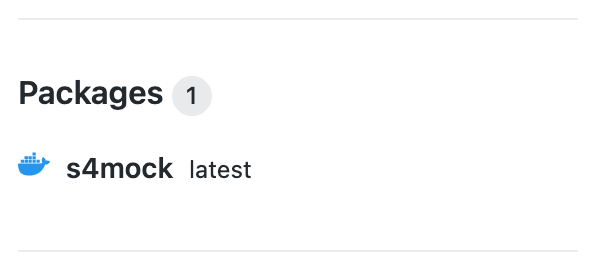

# Getting a component up and running on the Kyma runtime

**Contents**
- [Overview](#overview)
- [Steps](#steps)
  - [Build and publish a Docker image](#build-and-publish-a-docker-image)
  - [Create a k8s secret for registry access](#create-a-k8s-secret-for-registry-access)
  - [Make a deployment to Kyma](#make-a-deployment-to-kyma)


## Overview

This document explains the steps required to get a component running on the Kyma runtime, which is based on Kubernetes (k8s). These steps are necessary for some of the components in this Developer Keynote repository, specifically the [SANDBOX](s4hana/sandbox/README.md#on-sap-cloud-platform---kyma-runtime) and [BRAIN](cap/brain/README.md#on-sap-cloud-platform---kyma-runtime) components. 

If you've come here from the main READMEs for either of those two components, remember that context - i.e. you're here to get either the SANDBOX or the BRAIN component up and running on the Kyma runtime. Note that throughout this document, each example shown will be based on one or the other component only.

There are a number of steps:

1. build a Docker image for the component
1. publish the image to a container registry
1. create a k8s secret for registry access
1. make a deployment to Kyma

In other words, in a Kyma context, the component exists as a container and we'll be using Docker to create the image from which our component container can be created. Moreover, we need to make that container image available somewhere for the Kyma runtime to retrieve it and start up one or more instances of it.

That place where we'll make the container image available is in a [package registry provided by GitHub](https://github.com/features/packages), specifically connected to your forked version of this repository. If you have a look at the source of your fork - [the original Developer Keynote repository](https://github.com/SAP-samples/teched2020-developer-keynote) i.e. the one in the [SAP-samples](https://github.com/SAP-samples/) organization on GitHub - you'll see that it has a list of "Packages" associated with it, as shown in the bottom right of this screenshot:


You can also see them in [the SAP-samples organization-level package list, filtered by repository](https://github.com/orgs/SAP-samples/packages?repo_name=teched2020-developer-keynote).

Note that the packages each have a Docker icon next to them; this denotes that they are Docker packages (there are other package types that can be stored in the repository, such as those from NPM and NuGet).

Note also that access to packages in the GitHub package registry requires authentication - this is why you'll need to generate a secret to make available to Kyma to use, to retrieve the container image from there.

## Steps

Once you've completed the steps in this section, you'll also have a package in the GitHub Package Registry in the context of your own repository, and it will be that package that your Kyma runtime instance retrieves. Depending on where you've come from to read this document, this package will be for one of the following components:

|Component|[SANDBOX](../s4hana/sandbox/)|[BRAIN](../cap/brain/)|
|-|-|-|
|Component Directory (`componentdir`)|`s4hana/sandbox/`|`cap/brain/`|
|Package (`app`)|`s4mock`|`brain`|
|App Artifact Directory (`dir`)|`router/`|.|

Throughout the instructions in this document, you must ensure that you specify the right details for the component you're building for Kyma, as shown in this table. The properties `componentdir`, `app` and `dir` will become clear shortly.

### Build and publish a Docker image

If you have Docker in your development environment, you can use the `docker` command line tool to achieve the first two steps; there are helper scripts (each called `d`) in the SANDBOX and BRAIN components' directories explicitly for this purpose.

However, if you're using the App Studio as your [development environment](../README.md#a-development-environment) then you don't have direct access to a Docker engine and you won't be able to make use of the `docker` tool or the `d` scripts. 

Instead, you can use [GitHub Actions](https://github.com/features/actions) in the context of your repository to both build and publish the Docker image (i.e. take care of the first two steps in one go). There is a GitHub Actions workflow [Build and publish Docker image](../.github/workflows/image-build-and-publish.yml) available in this repository. You can see it in the "Actions" area of this repository (again, make sure you're working within _your fork_ of the Developer Keynote repository):


This workflow consists of a single job with multiple steps, which perform the following activities:

1. Checks out the repository content (into the workflow's runtime)
1. Builds the Docker image
1. Logs into the package registry and pushes the image there

While browsing the [workflow source](../.github/workflows/image-build-and-publish.yml), you will notice also that the workflow defines three inputs, as follows:

|Input|Description|
|-|-|
|`componentdir`|The directory in the repo where the component lives|
|`app`|The name for the package (e.g. `s4mock`, `brain` or `calculationservice`)|
|`dir`|The directory containing the app artifacts (relative to the component's location in the repo)|

In other words, yes - this workflow is designed to offer Docker image build and publishing services for multiple components in this repository, namely the SANDBOX, BRAIN and CONVERTER ("calculationservice") components ... and so the workflow must be parameterized.

> If this is the first time you are using workflows on your forked repository, be aware that you'll have to [enable them first](../../enabling-workflows.md).

Start the workflow (in your own repository) and be ready to supply the appropriate values for the parameters. Select the workflow ("Build and publish Docker image") and use the `workflow_dispatch` event trigger, i.e. the "Run workflow" button to manually invoke it. Specify the appropriate values for your component. This following screenshot shows an example specifically for the SANDBOX component - make sure you specify values appropriate for the component you're dealing with (using values from the table earlier, at the start of the [Steps](#steps) section):


> As you can see, the example in the screenshot is from where the user [qmacro](https://github.com/qmacro) has forked the Developer Keynote repository into their own space. When you do this, you should be looking at **your own fork**.

Regarding the branch value for the "Use workflow from" parameter - keep it as it is (it most likely will be "main" if you've forked your repo from the original one in the SAP-samples organization).

Then, for the SANDBOX component, specify:

|Parameter|Value|
|-|-|
|The directory in the repo where the component lives|`s4hana/sandbox/`|
|The name for the package (e.g. s4mock, brain or calculationservice)|`s4mock`|
|The directory containing the app artifacts (relative to the component's location in the repo)|`router/`|

But for the BRAIN component, specify:

|Parameter|Value|
|-|-|
|The directory in the repo where the component lives|`cap/brain/`|
|The name for the package (e.g. s4mock, brain or calculationservice)|`brain`|
|The directory containing the app artifacts (relative to the component's location in the repo)|`.`|

The workflow should complete successfully. If you wish, examine the detailed output of the steps (by expanding the `>` symbols shown in the screenshot). Here's an example, from the build and publish workflow for the `s4mock` package (SANDBOX component):


The result of this successful workflow execution should be a package representing a Docker image version of your component, in the GitHub package registry, associated with your repository. You will be able to see this on the main page of your repository. This is what it would look like for the SANDBOX component (`s4mock` package):



You'll also be able to see it in the general package listing for your GitHub user in a similar way to the listing for this SAP-samples based repository: https://github.com/orgs/SAP-samples/packages?repo_name=teched2020-developer-keynote - just substitute the `orgs/SAP-samples` part with your GitHub username to see your own.

### Create a k8s secret for registry access

So at this point you have a Docker container image in the GitHub packages registry, associated with your own repository. If you look at the last step in the [workflow source](../.github/workflows/image-build-and-publish.yml) you'll see it looks like this:

```yaml
    - name: Push the image to GitHub Package Registry
      if: ${{ success() }}
      run: |
        echo ${{ secrets.GITHUB_TOKEN }} | docker login ${HUB} --username ${USER} --password-stdin
        docker push ${HUB}/${GITHUB_REPOSITORY}/${{ github.event.inputs.app }}:${TAG}
```

Note the `docker login` part before the `docker push` - authentication is required to connect to and interact with this registry. Not only for pushing images but also for retrieving them. That's why we now need to create a [secret](https://kubernetes.io/docs/concepts/configuration/secret/) with the same credentials, so that the image can be retrieved when we make the deployment.

> You must be first authenticated with your Kyma runtime on SAP Cloud Platform for this step, and have the Kyma runtime configuration downloaded and set up. See the [Set up the Kyma runtime configuration](../usingappstudio/README.md#set-up-the-kyma-runtime-configuration) section of [Using the SAP Business Application Studio](../usingappstudio/).

There are different types of secrets - the type we need to create is a Docker registry secret. A typical incantation to create such a secret looks like this:

```
kubectl create secret docker-registry <SECRETNAME> \
  --docker-server=https://docker.pkg.github.com \
  --docker-username=<YOUR GITHUB ORG/USERNAME> \
  --docker-password=<ACCESS TOKEN> \
  --docker-email=<YOUR GITHUB EMAIL>
```

This has been also made available as an action in another script (`k`) in your component's directory. Ensure you're in your component's directory and execute it like this (the following invocation examples are from the BRAIN component's `cap/brain/` directory, if you're working with another component, the prompt will look different, but the invocation will be the same):

```shell
user: brain $ ./k
Usage: k <options> <action>

with options:
-u | --user <GitHub user>
-r | --repository <GitHub repository>

with actions:
- deploy: make deployment (needs -u and -r)
- configmap: create and deploy config map
- secret: create secret for GitHub Package registry access
```

Create the secret like this:

```shell
user: brain $ ./k secret
Setting up docker-registry secret regcred for access to https://docker.pkg.github.com
Secret regcred exists - will remove first (hit enter to continue)
secret "regcred" deleted
Enter email: <YOUR GITHUB EMAIL>
Enter username: <YOUR GITHUB ORG/USERNAME>
Enter password / token: <ACCESS TOKEN>
secret/regcred created
```

> If there already is a secret of the same name you'll be prompted to have it deleted first, as shown in this example output.

You can check that the secret has been created, thus:

```shell
user: brain $ kubectl get secrets
NAME                              TYPE                                  DATA   AGE
regcred                           kubernetes.io/dockerconfigjson        1      109s
...
```

### Make a deployment to Kyma

Now everything is ready to make a deployment to the Kyma runtime. The deployment is described in the component-specific `deployment.yaml` file that you will find in the Component Directory (where you came from to read this document), which includes a number of important references that should now be familiar to you. 

Take a quick look at the contents of your `deployment.yaml` file to see them, and you'll also spot a URL for the Docker image, stored in the GitHub Package Registry, that has generic values "OWNER" and "REPOSITORY". These will be replaced by the `k` script when you run it with the `deploy` action, according to the values you specify for the user and repository options.

The deployment is quite simple at this stage (as you can see from the `deploy` function in the `k` script). Invoke it with the "deploy" action. Here's an example of that, for the SANDBOX component, where the user who has forked the `teched2020-developer-keynote` repository is "qmacro":

```shell
user: sandbox $ ./k -u qmacro -r teched2020-developer-keynote deploy
Deploying to k8s
configmap/appconfig created
deployment.apps/s4mock created
service/s4mock created
apirule.gateway.kyma-project.io/s4mock created
```

Your component is now deployed to the Kyma runtime in your SAP Cloud Platform subaccount.

Good work! Don't forget to return to where you came from, to continue following any component-specific instructions. 
