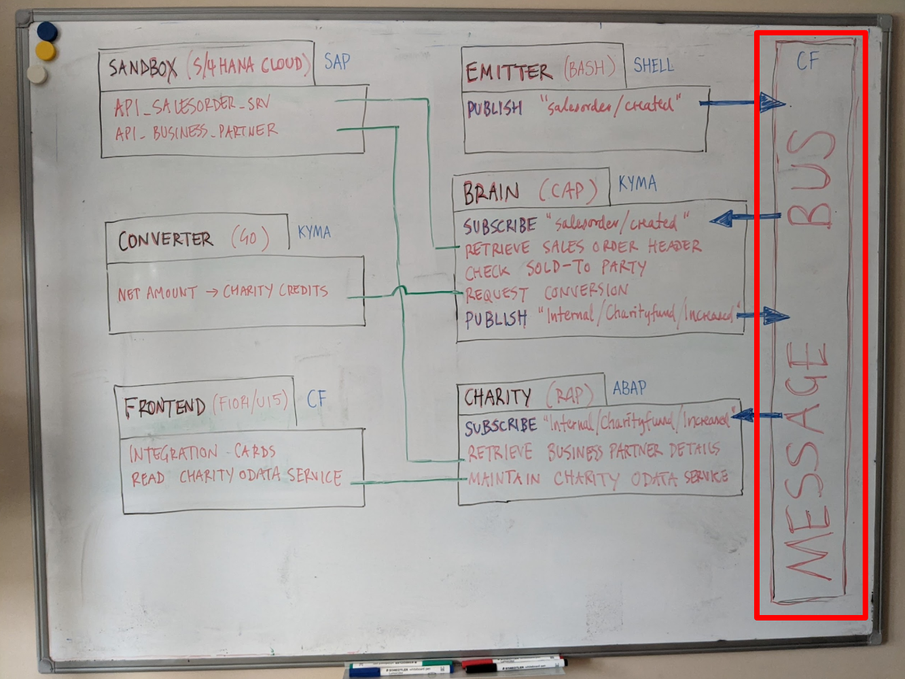
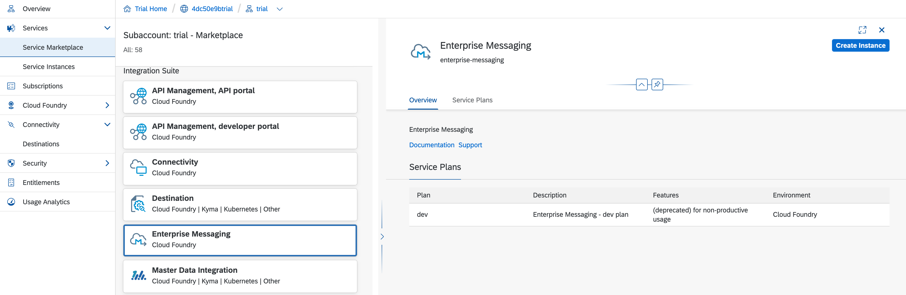
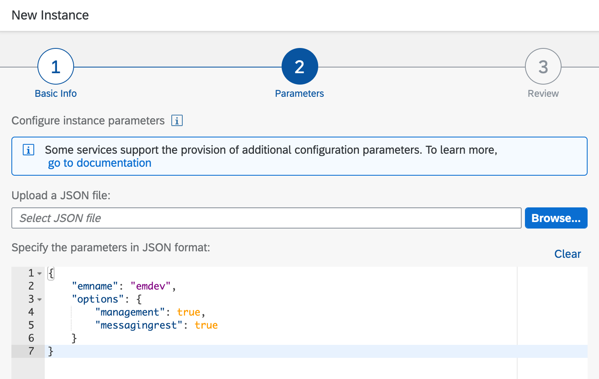
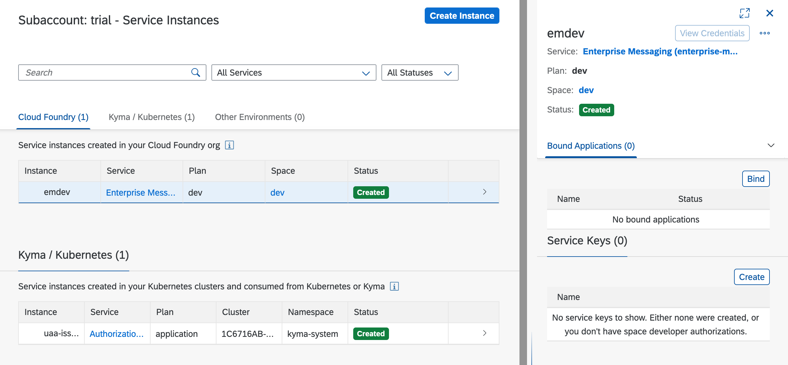
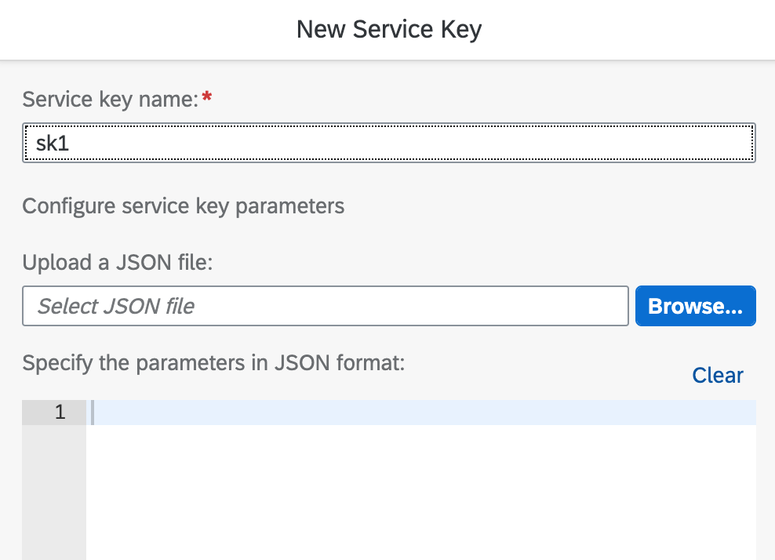

# Message bus setup

**Contents**
- [Overview](#Overview)
- [Setup in the Cockpit](#setup-in-the-cockpit)
  - [Creating the service instance](#creating-the-service-instance)
  - [Creating the service key](#creating-the-service-key)
- [Setup on the command line](#setup-on-the-command-line)
  - [Using a script](#using-a-script)
  - [Manually](#manually)

## Overview

This document will help you set things up for the MESSAGE BUS part of the whiteboard diagram.



There are two things to set up, which should have specific names, too (as other components will rely upon those names):

- an instance of the SAP Enterprise Messaging service: "emdev"
- a service key for that instance, that apps can use to authenticate: "sk1"

Moreover, the service instance parameters should ensure that the management and messaging APIs are enabled, and should look like this (you'll see how and where these parameters are used later in this README):

```json
{
  "emname": "emdev",
  "options": {
    "management": true,
    "messagingrest": true
  }
}
```

With respect to the service instance, there's the "dev" plan available to you as a trial user; while this is marked as deprecated, it is still a very workable plan and exposes everything we need here.

There are many ways to set things up like this; here, we'll show you a couple of different ways:

- Via the graphical interface of the SAP Cloud Platform Cockpit, described in the [Setup in the Cockpit](#setup-in-the-cockpit) section
- On the command line, either using a script, or doing it manually, command by command. This is described in the [Setup on the command line](#setup-on-the-command-line) section

Pick one approach and follow the instructions.

## Setup in the Cockpit

You can create both the service instance and the service key using features of the SAP Cloud Platform Cockpit.

### Creating the service instance

First, search in the Service Marketplace section of the Cockpit for the Enterprise Messaging service. Once you've found it, you can then set up a "dev" plan instance in your trial account using the "Create Instance" button shown in this screenshot:



Be sure to specify the name "emdev" as the Instance Name (in the Basic Info step of the wizard), and use the JSON above for the instance parameters when asked - you can see where in this screenshot:



Once the instance has been created, you can then create the service key.

### Creating the service key

In order to interact with the message bus, various components need to authenticate with it. For example, the [EMITTER](../s4hana/event/) component uses the messaging API to emit an event message; in order to do that successfully, it uses the service key information to authenticate first.

With the "emdev" instance selected, use the "Create" button in the "Service Keys" section to create a service key:



In the dialog that appears, ensure you specify the name "sk1" for the "Service key name". You can leave any other fields as they are:



And that's it - once created, you have everything you need for the message bus portion of this repository.


## Setup on the command line

If you prefer to set things up from the command line, you can do so too. This will also indirectly introduce you to some of the uses of the Cloud Foundry (CF) Command Line Interface (CLI), namely `cf`. We've provided a script, but you can also run the commands individually by looking at the script's contents and learning what it does.

This section assumes you've opted to follow the instructions on [using the SAP Business Application Studio](../usingappstudio/) for your [development environment](../README.md#a-development-environment), but you can of course set up and run this script in your own environment.
In a Terminal in your App Studio Dev Space, first make sure you're in this `messagebus` directory, authenticated with your CF endpoint and have your trial account related organization and space selected:

```
user: teched2020-developer-keynote $ cd messagebus
user: messagebus $ pwd
/home/user/projects/teched2020-developer-keynote/messagebus
user: messagebus $ cf login
API endpoint: https://api.cf.eu10.hana.ondemand.com

Email: sapdeveloper@example.com

Password:
Authenticating...
OK

Select an org:
1. 14ee89fftrial
2. ...

Org (enter to skip): 1
Targeted org 14ee89fftrial

Targeted space dev

API endpoint:   https://api.cf.eu10.hana.ondemand.com (API version: 3.91.0)
User:           sapdeveloper@example.com
Org:            14ee89fftrial
Space:          dev
user: messagebus $
```

> Of course, you can use the "CF: Login to cloud foundry" command in the Command Palette if you prefer.

Now, the `cf` commands that will be used will target the appropriate CF organization and space. You're now ready to set up the service instance and service key, either via a script or manually.

### Using a script

In the same directory as this message bus README there is a script and a script library:

- the [`service-setup`](service-setup) script sets up the service instance and service key
- the [`settings.sh`](settings.sh) script library contains settings to specify the names required (i.e. "emdev", "sk1" and so on)

> `settings.sh` is actually a symbolic link to a shared file in the root of this repository - you can see this if you list the contents of the directory with `ls -l`.

The `service-setup` script will create the service instance and the service key.

Run the `service-setup` script:

```
user: messagebus $ ./service-setup
Creating service instance emdev in org 14ee89fftrial / space dev as sapdeveloper@example.com...
OK

Creating service key sk1 for service instance emdev as sapdeveloper@example.com...
OK
```
> You can rerun this script if you need to - if the service instance or service key already exist, you'll be notified (by `cf`).

### Manually

You can also run the `cf` commands manually. Here's a brief summary of what you need to do.

First, create the service instance:

```
user: messagebus $ cf create-service enterprise-messaging \
  dev \
  emdev \
  -c '{ "emname": "emdev", "options": { "management": true, "messagingrest": true } }'
```

Now create the service key:

```
user: messagebus $ cf create-service-key emdev sk1
```

If you look in the [`service-setup`](service-setup) script you'll see there's a final step to remove any service key cache file; it's worth doing that here too in this manual mode:

```
user: messagebus $ rm -f sk-emdev-sk1.json
```
