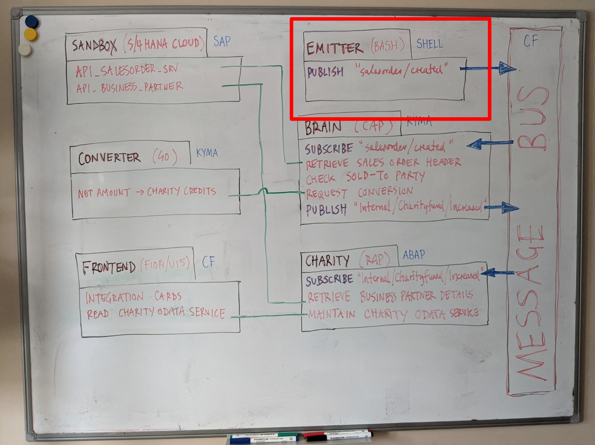
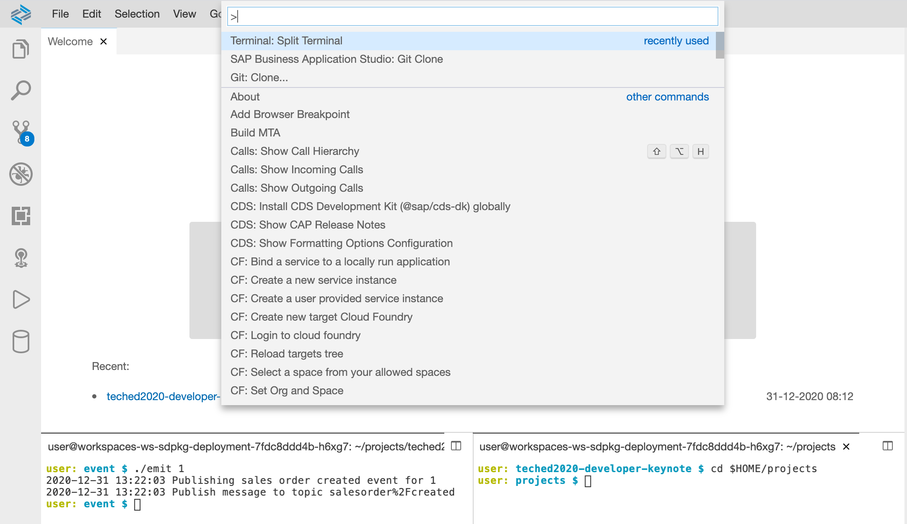

# The EMITTER component

**Contents**

- [Overview](#overview)
- [Requirements](#requirements)
- [Usage](#usage)
- [Checking event messages](#checking-event-messages)
  - [Overview](#overview-1)
  - [Setting up](#setting-up)
  - [Queue and queue subscription to a topic](#queue-and-queue-subscription-to-a-topic)
  - [Publishing of another message](#publishing-of-another-message)
  - [Consuming the message from the queue](#consuming-the-message-from-the-queue)


## Overview

This section relates to the SAP S/4HANA Cloud event that is used to kick off the whole process, and is represented by the "EMITTER" block in the whiteboard diagram.



It can be found in the [`s4hana/event/`](./) directory of this repository.

This component starts off the whole flow by emitting an event message to the "salesorder/created" topic on the instance of the Enterprise Messaging service.

It is a single Bash shell script `emit`, supported by two helper libraries:

- `localutils.sh` providing basic functions for logging, access token retrieval, and so on
- `settings.sh` providing the actual names of instances, plans and service keys

> `settings.sh` is actually a symbolic link to a shared file in the root of this repository.

The EMITTER component uses the [Messaging API](https://help.sap.com/doc/3dfdf81b17b744ea921ce7ad464d1bd7/Cloud/en-US/messagingrest-api-spec.html) to publish a message to a topic on the bus provided by this project's Enterprise Messaging service instance. The specific API endpoint used is `POST /messagingrest/v1/topics/{topic-name}/messages`.

The API call is authenticated with OAuth 2.0, whereby an access token is retrieved using facilities in the `localutils.sh` library and details in the `settings.sh` library.

## Requirements

The `emit` Bash script uses some external tools, none of which are obscure, but some of which you may need to explicitly install:

- `uuidgen` (often found in the `uuid-runtime` Linux package)
- `curl` (see [the `curl` home page](https://curl.haxx.se/))
- `cf` (see the [Install Guide](https://docs.cloudfoundry.org/cf-cli/install-go-cli.html))
- `yq` (see [the `yq` home page](https://github.com/mikefarah/yq))
- `jq` (see [the `jq` home page](https://stedolan.github.io/jq/))

> If you are using the SAP Business Application Studio (App Studio) for your development environment, and have followed the [Using the SAP Business Application Studio](../../usingappstudio/) instructions, these tools will already be installed and ready for you to use (from the [Add tools to your Dev Space](../../usingappstudio/README.md#add-tools-to-your-dev-space) step).

You'll also need a message bus, in the form of an instance of the SAP Enterprise Messaging service. Follow the [Message bus setup](../../messagebus) instructions if you haven't done already.

These instructions assume you've forked this repository (see the [Download and Installation](../../README.md#download-and-installation) instructions) and cloned it locally.

## Usage

The component itself is the `emit` script in this directory. It's designed to be used from the command line, and expects a single parameter that is mandatory - the sales order number. In order for the end-to-end process to make sense and work properly, this must be a sales order that exists in the S/4HANA mock system. Use your [SANDBOX component](../sandbox) to get a proxy running in front of the API Hub's mock service for API_SALES_ORDER_SRV, and pick a valid sales order from the `A_SalesOrder` entityset.

For example, if you are currently running a [local version of the proxy](../sandbox#locally), look at the first 10 sales orders in the entityset at

`http://localhost:5000/sap/opu/odata/sap/API_SALES_ORDER_SRV/A_SalesOrder?$top=10`

and pick one of the sales order IDs from that list (get the value from the `SalesOrder` property).

To use this EMITTER component:

1. Make sure you're in this `s4hana/event/` directory
1. Make sure you're logged into CF and connected to your organization and space where you have your message bus
1. Choose a sales order number as described above (e.g. 1)
1. Call the script, passing that sales order number (e.g. `./emit 1`)

> Before making the call to the `emit` script, you may also want to remove any existing `sk*.json` file, which may contain stale service key information - it will be regenerated when you call `emit`.

These steps should look like this - there will be a couple of log messages produced if successful:

```
user: teched2020-developer-keynote $ cd s4hana/event/
user: event $ ./emit 1
user: event $ cf login
API endpoint: https://api.cf.eu10.hana.ondemand.com

Email: sapdeveloper@example.com

Password:
Authenticating...
OK

Select an org:
1. 14ee89fftrial
2. ...

Org (enter to skip): 1
Targeted org 14ee89fftrial

Targeted space dev

API endpoint:   https://api.cf.eu10.hana.ondemand.com (API version: 3.91.0)
User:           sapdeveloper@example.com
Org:            14ee89fftrial
Space:          dev
user: event $ rm sk-emdev-sk1.json
user: event $ ./emit 1
2020-12-31 11:25:22 Publishing sales order created event for 1
2020-12-31 11:25:22 Publish message to topic salesorder%2Fcreated
```

> The `%2F` in the topic name is a URL encoded `/` which is required because the Messaging API endpoint uses the topic name in the URL path. We could have the `emit` script encode it, but that would mean an extra dependency on e.g. Python or [an npm package](https://www.npmjs.com/package/url-decode-encode-cli) for example, which is not worth it for this.

## Checking event messages

The output at the end of the previous section, stating that a sales order created event was indeed published, is all well and good, but the rhyming proverb _Доверяй, но проверяй_ ([Trust, but verify](https://en.wikipedia.org/wiki/Trust,_but_verify)) encourages to dig in a little to check what was published.

This is an optional last step, in case you're interested.

### Overview

Accompanying the [Diving into messaging on SAP Cloud Platform series](https://www.youtube.com/playlist?list=PL6RpkC85SLQCf--P9o7DtfjEcucimapUf) on the Hands-on SAP Dev show (see [An overview of SAP Developers video content](https://blogs.sap.com/2020/11/09/an-overview-of-sap-developers-video-content/) for more info) there's a repository [cloud-messaging-handsonsapdev](https://github.com/SAP-samples/cloud-messaging-handsonsapdev).

In this repository there are scripts that allow you to use the SAP Enterprise Messaging APIs in a simple way from the comfort of the terminal. There are two APIs, each with various endpoints. Briefly, they are:

- Management: relating to queues and queue subscriptions
- Messaging: relating to production and consumption of messages (including via webhook subscriptions)

To verify what is actually happening with this EMITTER component, you can use the Management API to set up a test queue & subscribe it to the "salesorder/created" topic. Then, once you've used the `emit` script as described earlier, you can use the Messaging API to consume the messages from that test queue and have a quick look at the contents. This way you can get a bit closer to what's going on, while also verifying for yourself that `emit` did what it said it did.

### Setting up

First, open up a second terminal in which to perform these steps. You can use the shortcut Ctrl-` to open up a new terminal window, or you can use the "Split Terminal" feature to create another terminal window side-by-side. This screenshot shows a second split terminal, which was created by using the "two boxes" icon in the top right of the first terminal window (you can also use the "Terminal: Split Terminal" command from App Studio's Command Palette, also shown in the screenshot):



Next, in the second terminal, move to the `projects/` directory, which is where your current cloned repository is (this is also shown in the screenshot above), like this:

```
user: teched2020-developer-keynote $ cd $HOME/projects
user: projects $
```

If at this point you list the contents of the `projects/` directory you'll see the root of this repository, i.e. a directory called `teched2020-developer-keynote`:

```bash
user: projects $ ls
teched2020-developer-keynote
```

Now clone the [cloud-messaging-handsonsapdev](https://github.com/SAP-samples/cloud-messaging-handsonsapdev) repository:

```bash
user: projects $ git clone https://github.com/SAP-samples/cloud-messaging-handsonsapdev.git
Cloning into 'cloud-messaging-handsonsapdev'...
remote: Enumerating objects: 322, done.
remote: Total 322 (delta 0), reused 0 (delta 0), pack-reused 322
Receiving objects: 100% (322/322), 113.32 KiB | 547.00 KiB/s, done.
```

At this point there are two directories in `projects/`, one for each of the repositories you now have cloned here: 

```bash
user: projects $ ls
cloud-messaging-handsonsapdev  teched2020-developer-keynote
```

Move into the new `cloud-messaging-handsonsapdev/` directory:

```bash
user: projects $ cd cloud-messaging-handsonsapdev/
user: cloud-messaging-handsonsapdev $
```

At this point you're ready to invoke the [`management`](https://github.com/SAP-samples/cloud-messaging-handsonsapdev/blob/main/management) and [`messaging`](https://github.com/SAP-samples/cloud-messaging-handsonsapdev/blob/main/messaging) scripts that allow you to use the Management and Messaging APIs respectively.

Try them both out now, with no arguments, to get a feel for what they offer.

> Before invoking either the `management` or `messaging` script, ensure you're authenticated and connected to your CF org and space with `cf login`.

The `management` script offers queue and queue subscription related API endpoints:

```bash
user: cloud-messaging-handsonsapdev $ ./management
create_update_queue
delete_queue
get_queue
list_queues
list_queue_subscriptions
create_update_queue_subscription
delete_queue_subscription
```

The `messaging` script offers message production and consumption API endpoints:

```bash
user: cloud-messaging-handsonsapdev $ ./messaging
publish_message_to_topic
publish_message_to_queue
list_webhook_subscriptions
get_webhook_subscription
create_webhook_subscription
delete_webhook_subscription
trigger_handshake_request
pause_webhook_subscription
resume_webhook_subscription
consume_message_from_queue
acknowledge_message_consumption
```

### Queue and queue subscription to a topic

Use the `management` script to create a test queue, and then connect it to the "salesorder/created" topic.

First, the queue. Let's call it "test":

```
user: cloud-messaging-handsonsapdev $ ./management create_update_queue test
{
  "name": "test",
  "messageCount": 0,
  "queueSizeInBytes": 0,
  "unacknowledgedMessageCount": 0,
  "maxQueueSizeInBytes": 0,
  "maxQueueMessageCount": 0,
  "respectTtl": null,
  "deadMsgQueue": null
}
```

Now, the queue subscription, connecting this "test" to the "salesorder/created" topic:

```bash
user: cloud-messaging-handsonsapdev $ ./management create_update_queue_subscription test salesorder/created
{
  "queueName": "test",
  "topicPattern": "salesorder/created"
}
```

Let's just check to see if there are any messages in this new "test" queue:

```bash
user: cloud-messaging-handsonsapdev $ ./management get_queue test
{
  "name": "test",
  "messageCount": 0,
  "queueSizeInBytes": 0,
  "unacknowledgedMessageCount": 0,
  "maxQueueSizeInBytes": 0,
  "maxQueueMessageCount": 0,
  "respectTtl": null,
  "deadMsgQueue": null
}
```

We can see from the value for the `messageCount` property that there are none (which makes sense, we've only just created it).

So far so good. Now we're ready to use the `emit` script again to create another "salesorder/created" message.

### Publishing of another message

Back over in the first terminal (on the left in the screenshot above), use the `emit` script again to publish another message to the "salesorder/created" topic.

> For those wondering, the message we published earlier disappeared, as there was no queue subscribed to the topic, and it is the queue mechanism, rather than the topic mechanism, where messages are held.

```bash
user: event $ ./emit 1
2020-12-31 13:59:15 Publishing sales order created event for 1
2020-12-31 13:59:15 Publish message to topic salesorder%2Fcreated
```

Back over in the second terminal (on the right), let's check again to see if there are now any messages in the "test" queue:

```bash
user: cloud-messaging-handsonsapdev $ ./management get_queue test
{
  "name": "test",
  "messageCount": 1,
  "queueSizeInBytes": 256,
  "unacknowledgedMessageCount": 0,
  "maxQueueSizeInBytes": 0,
  "maxQueueMessageCount": 0,
  "respectTtl": null,
  "deadMsgQueue": null
}
```

We now have one message in the queue!

### Consuming the message from the queue

Let's consume that message, using the Messaging API. That way we can have a look at the details.

```bash
user: cloud-messaging-handsonsapdev $ ./messaging consume_message_from_queue test
2020-12-31 14:03:41 Consume message from queue
{"type":"sap.s4.beh.salesorder.v1.SalesOrder.Created.v1","specversion":"1.0","source":"/default/sap.s4.beh/DEVCLNT001","id":"db13c94e-c20f-4b2e-8171-6970104721a0","time":"2020-12-31T13:59:15Z","datacontenttype":"application/json","data":{"SalesOrder":"1"}}
```

Great - we can see that the message is indeed what we're expecting. If we format the message JSON, we can read it a little better:

```bash
user: cloud-messaging-handsonsapdev $ echo $'{"type":"sap.s4.beh.salesorder.v1.SalesOrder.Created.v1","specversion":"1.0","source":"/default/sap.s4.beh/DEVCLNT001","id":"db13c94e-c20f-4b2e-8171-6970104721a0","time":"2020-12-31T13:59:15Z","datacontenttype":"application/json","data":{"SalesOrder":"1"}}' | jq .
{
  "type": "sap.s4.beh.salesorder.v1.SalesOrder.Created.v1",
  "specversion": "1.0",
  "source": "/default/sap.s4.beh/DEVCLNT001",
  "id": "db13c94e-c20f-4b2e-8171-6970104721a0",
  "time": "2020-12-31T13:59:15Z",
  "datacontenttype": "application/json",
  "data": {
    "SalesOrder": "1"
  }
}
```

Nice work!


