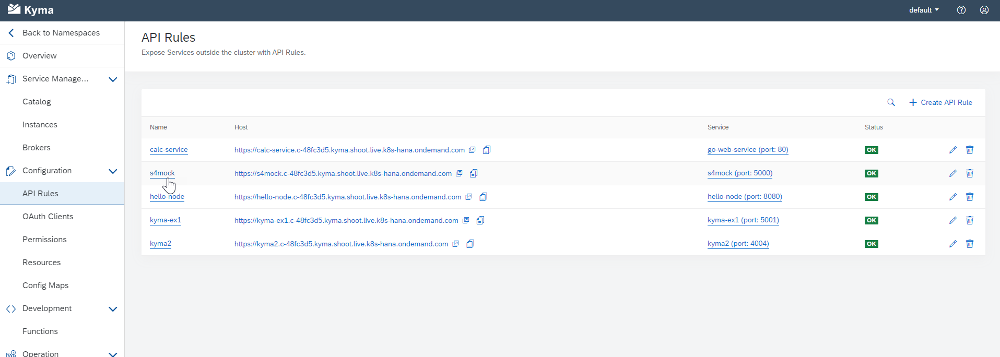

# Mock Router

This mock application redirects all incoming traffic to the SAP API Business Hub sandbox system. The application router will attach the required API key to all requests during transit.

## Prerequisites

1. [Configure Essential Local Development Tools](https://developers.sap.com/group.scp-local-tools.html)
2. Clone this repository
    ```
    git clone https://github.com/SAP-samples/teched2020-developer-keynote
    ```

## Configuration

1. Get your API key from [SAP API Business Hub](https://api.sap.com) and copy the value.
2. Insert the value in the `API_KEY` property in `default-env.json`.

If needed, you can also adjust parameters such as the timeout for all redirects.

## Deployment to Cloud Foundry

1. Build the project
    ```
    mbt build
    ```
2. Deploy
    ```
    cf deploy mta_archives/s4-mock_1.0.0.mtar
    ```
3. Access <https://YOUR-APP.hana.ondemand.com/sap/opu/odata/sap/API_SALES_ORDER_SRV/$metadata> to see that in action. Useful command:
    ```
    open `cf app s4-mock-router | awk '/^routes/ { print "https://"$2"/sap/opu/odata/sap/API_SALES_ORDER_SRV/" }'`
    ```

## Deployment to Kyma

1. Create a secret for docker deployment from Github

``` shell
kubectl create secret docker-registry regcred --docker-server=https://docker.pkg.github.com --docker-username=<Github.com User> --docker-password=<Github password or token> --docker-email=<github email>
```

2. Add your SAP API Hub API Key to the deployment.yaml file on line 6

3. Run k8s_deploy.sh

4. Return to the Kyma Console and the API Rules. You should see a new API Rule named s4mock and the URL for this endpoint. Add **/sap/opu/odata/sap/API_SALES_ORDER_SRV/$metadata** to this URL to test. 


## Local run

You can also run the application router locally for testing purposes. To do this, change

Change in `default-env.json`:
```
  "destinations": [
    {
      "name": "apihub_sandbox",
      "url": "https://sandbox.api.sap.com"
    }
  ]
```
