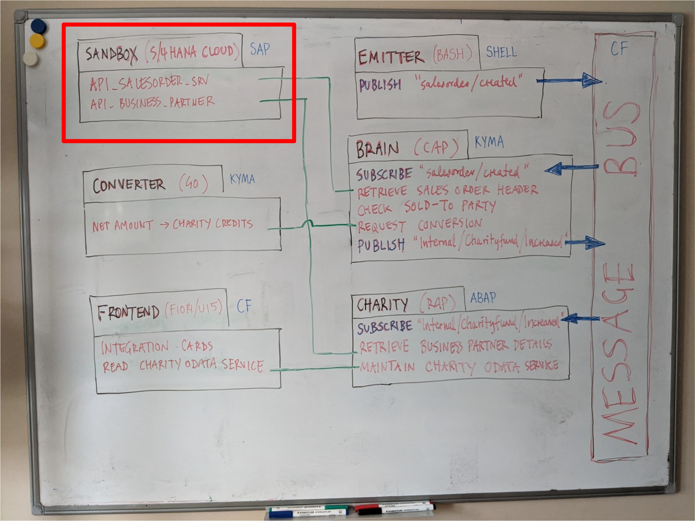
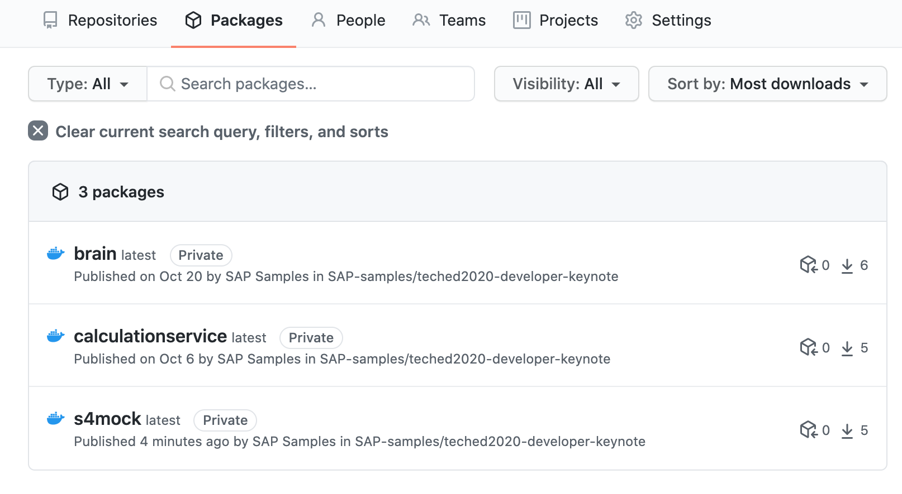
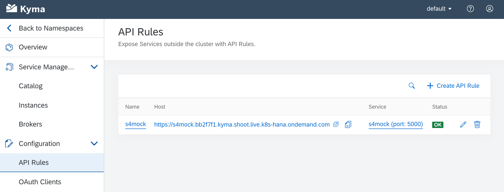
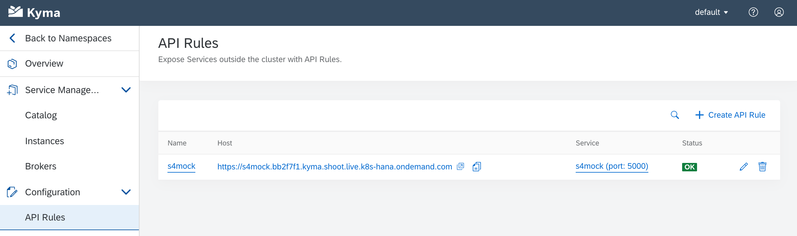

# Mock Router

This is a small app that acts as a proxy in front of the SAP API Business Hub (API Hub) sandbox system. Because the app itself is small, we'll take the opportunity to explore different ways of running it, without having to worry too much about _what_ we're running. So here we'll explore running locally, in Docker, on CF and on Kubernetes with Kyma.

## Overview

The context in which it runs is shown as the highlighted section of the whiteboard:



Access to the API Hub sandbox system is protected; each and every call to it needs to have an API key specified in an HTTP header. That is what this app does - attach the API key to all requests during transit.

There are two APIs that are used on the sandbox system that the API Hub makes available. Both are SAP S/4HANA Cloud APIs: [Sales Order (A2X)](https://api.sap.com/api/API_SALES_ORDER_SRV/resource) and [Business Partner (A2X)](https://api.sap.com/api/API_BUSINESS_PARTNER/resource).

In the developer keynote, this app is running in the Kyma runtime, but you can run it locally, locally in a Docker container, and also in Cloud Foundry. This README will show you how to get this app running in all four environments so you can compare and contrast them.

> This entire procedure assumes you have cloned this repository to your own space on GitHub, and that you are therefore aware of the values for OWNER (your GitHub org or username) and REPOSITORY (where you've cloned this) throughout the rest of this document. All the examples (of output, and so on) will be given based on the home org and repository for this content, i.e. `sap-samples/teched2020-developer-keynote`.

There are two helper scripts in this directory that have been written to help you through the steps, they are:

- `d` for Docker related activities
- `k` for Kyma / Kubernetes (k8s) related activities

We'll refer to the use of these scripts throughout the steps. You can of course run the actual commands directly if you wish, instead.


## Prerequisites

1. [Configure Essential Local Development Tools](https://developers.sap.com/group.scp-local-tools.html)

2. If you haven't done so already (see the "Download and Installation" instructions in the repository's [main README](../README.md)), clone *your fork* of this this repository, like this:
    ```
    $ git clone https://github.com/OWNER/REPOSITORY
    ```

3. Modify the `d` script in this directory and change the OWNER and REPOSITORY values in the `tag` variable (towards the top of the file) to reflect your own GitHub org or username and repository name. This is what the line looks like *before* modification, so you know what you're looking for:

    ```
    tag=docker.pkg.github.com/OWNER/REPOSITORY/s4mock:latest
    ```

## Configuration

The API key is unique to you and is available in the [preferences section](https://api.sap.com/preferences) of the API Hub. You'll need to specify it in two places, one for the Kyma runtime (Kubernetes deployment) and one for the other environments.

1. Log on to the API Hub and grab your API key from the [preferences section](https://api.sap.com/preferences).

2. Replace `YOUR-API-KEY` in [`deployment.yaml`](deployment.yaml) with your API key - this is for the Kyma deployment

3. Replace `YOUR-API-KEY` in [`router/default-env.json`](router/default-env.json) with your API key - this is for the other environments

Note that you will see another environment variable `destinations` specified in both places - this is a quick way of defining simple destinations instead of setting them up at the subaccount or service instance level on SAP Cloud Platform. (The `destinations.json` file is an unused configuration file used when having a destination automatically defined on SAP Cloud Platform, and has been kept in this repo for reference.)

## Running the app

As mentioned earlier, you can run this app in a number of different contexts. It's useful to go through each of these contexts to gain some familiarity and also to understand what's similar and what's different.

> For everything that follows, the assumption is that you're in this directory (i.e. where this `README.md` file is) when invoking commands, unless otherwise explicitly stated.

### Locally

You can run the app locally. Try this first. After moving to the app's directory (`router/`), install the module dependencies, and then start the app up:

```
$ cd router/
$ npm install
$ npm start
```

> Here, and elsewhere - the shell prompt is indicated with a `$` symbol.

You should see log output similar to this:

```
approuter@ start /Users/username/Projects/teched2020-developer-keynote/s4hana/sandbox/router
> node index.js

#2.0#2020 11 23 16:38:43:371#+00:00#WARNING#/LoggingLibrary################PLAIN##Dynamic log level switching not available#
#2.0#2020 11 23 16:38:43:585#+00:00#INFO#/approuter#####khuryg01##########khuryg01#PLAIN##Application router version 8.5.5#
#2.0#2020 11 23 16:38:43:589#+00:00#INFO#/Configuration#####khuryg05##########khuryg05#PLAIN##No COOKIES environment variable#
#2.0#2020 11 23 16:38:43:592#+00:00#WARNING#/Configuration#####khuryg08##########khuryg08#PLAIN##No authentication will be used when accessing backends. Scopes defined in routes will be ignored.#
#2.0#2020 11 23 16:38:43:592#+00:00#INFO#/Configuration#####khuryg08##########khuryg08#PLAIN##xs-app.json: Application does not have directory for static resources!#
#2.0#2020 11 23 16:38:43:593#+00:00#INFO#/Configuration#####khuryg08##########khuryg08#PLAIN##Replacing $XSAPPNAME will not take place - 'xsappname' property not found in UAA configuration.#
#2.0#2020 11 23 16:38:43:606#+00:00#INFO#/approuter#####khuryg01##########khuryg01#PLAIN##Application router is listening on port: 5000#
```

At this point, the app is running and listening for requests on the local loopback interface (`localhost`, or 127.0.0.1) on port 5000. To test it, try to access the `API_SALES_ORDER_SRV`'s service document at this address: http://localhost:5000/sap/opu/odata/sap/API_SALES_ORDER_SRV/. You should see the service document served to you.

When you've finished trying out the app locally, make sure you move back up a directory to where this `README.md` file is:

```sh
$ cd ..
```

### Locally in a Docker container

If you have Docker installed on your machine, you can also run this in a Docker container. You'll need to create a Docker image of this app if you want to deploy it to the Kyma runtime anyway, so now's a good time to set that image up and fire up a container based on that image to test it.

There is already a [`Dockerfile`](Dockerfile) contained in this directory that will inform the Docker image build process, and you can build the image with an invocation similar to this:

```
$ docker build -t <TAG> -f <DOCKERFILE> router/
```

This has been wrapped into a script along with other Docker related actions that you'll need. The script, also in this directory, is called `d` and you can see the actions that it supports by invoking it with no arguments:

```
$ ./d
Usage: d <action>
where <action> is one of:
- login: login to GitHub Packages
- build: create the Docker image
- run: run a container locally based on the image
- publish: publish the image to GitHub
```

The container you are going to run is based on an image defined in the `Dockerfile` file, and the image must be built first. So you can invoke the `d` script with the "build" action.


Here's the invocation, and the sort of output that you should see:

```
$ ./d build
Building image for router
[+] Building 4.0s (10/10) FINISHED
=> [internal] load .dockerignore
=> transferring context: 2B
=> [internal] load build definition from Dockerfile
=> transferring dockerfile: 37B
=> [internal] load metadata for docker.io/library/node:12.18.1
=> [1/5] FROM docker.io/library/node:12.18.1@sha256:2b85f4981f92ee034b51a3c8bb22dbb451d650d5c12b6439a169f8adc750e4b6
=> [internal] load build context
=> transferring context: 1.04MB
=> CACHED [2/5] WORKDIR /usr/src/app
=> CACHED [3/5] COPY /package*.json ./
=> CACHED [4/5] RUN npm install
=> [5/5] COPY /. .
=> exporting to image
=> exporting layers
=> writing image sha256:2a53e4da22f1fda40a69db1e1c7a46caa1b22ac960beddc811e29fdec2785499
=> naming to docker.pkg.github.com/sap-samples/teched2020-developer-keynote/s4mock:latest
```

You can check the image that has just been created, like this:

```
$ docker image ls
REPOSITORY                                                              TAG                 IMAGE ID            CREATED             SIZE
docker.pkg.github.com/sap-samples/teched2020-developer-keynote/s4mock   latest              2a53e4da22f1        9 minutes ago       994MB
...
```

Now the image exists, you can instantiate a container from it. Do this by using the "run" action with the `d` script.

```
$ ./d run
Running detached instance of image locally
61538774a32d66eaa5e28ad721389ca1378cb1d485ca6f4d19cdf33a07d423a2
```

Note that the invocation includes the `-d` switch to tell Docker to run the image in "detached" (i.e. background) mode - in which case just the container ID is printed. But the container is running, and inside it, the same Node process as before is running. The `-p` switch (inspect the source code of the [`d`](d) script to check) exposes the port 5000 to the host (i.e. your machine) so you can connect to the service as if it was running directly locally, as before.

Check that you can access the `API_SALES_ORDER_SRV`'s service document again, at this same address: http://localhost:5000/sap/opu/odata/sap/API_SALES_ORDER_SRV/. You should see the service document served to you again, but this time, via the proxy app running inside the container.

## On SAP Cloud Platform - Cloud Foundry runtime

During the DK100 Developer Keynote demo itself, this app is run in the cloud, on SAP Cloud Platform, and specifically in the Kyma runtime. But you can also run it in the Cloud Foundry (CF) runtime, and this section is in case you want to do that.

Because of the simplicity of the app and the fact that it doesn't depend on anything else, we can use the simple `cf push` approach. 

Before running the `cf push` command, make sure you're logged in and connected to your CF organization and space. Check what your CF API endpoint is from your SAP Cloud Platform Cockpit and issue the `cf login` command. The flow will look something like this (your API endpoint may be different):

```sh
$ cf login
API endpoint: https://api.cf.eu10.hana.ondemand.com

Email: sapdeveloper@example.com

Password: 
Authenticating...
OK

Select an org:
1. 4dc50e9btrial
2. p123456789trial

Org (enter to skip): 1
Targeted org 4dc50e9btrial

Targeted space dev

API endpoint:   https://api.cf.eu10.hana.ondemand.com (API version: 3.88.0)
User:           sapdeveloper@example.com
Org:            4dc50e9btrial
Space:          dev
$
```

Here's what the `cf push` invocation looks like, and the sort of thing you should see (lots of output removed for readability):

```
$ cf push --random-route -p router proxyapp
Pushing app proxyapp to org 58f45caftrial / space dev as sapdeveloper@example.com...
Getting app info...
Creating app with these attributes...
+ name:       proxyapp
  path:       /Users/username/Projects/teched2020-developer-keynote/s4hana/sandbox/router
  routes:
+   proxyapp-wise-gnu-hc.cfapps.eu10.hana.ondemand.com

Creating app proxyapp...
Mapping routes...
Comparing local files to remote cache...
Packaging files to upload...
Uploading files...
...
Staging app and tracing logs...
   Downloading uas_dataflow_server_buildpack...
   Downloading ruby_buildpack...
   ...
   Exit status 0
   Uploading droplet, build artifacts cache...
   ...
   Uploading complete
   Cell f0e91f7f-390f-4ac0-9c81-28a3ae3c58cb stopping instance 4a89654f-6605-437c-bc76-c6d1f9bf63a4
   Cell f0e91f7f-390f-4ac0-9c81-28a3ae3c58cb destroying container for instance 4a89654f-6605-437c-bc76-c6d1f9bf63a4
   Cell f0e91f7f-390f-4ac0-9c81-28a3ae3c58cb successfully destroyed container for instance 4a89654f-6605-437c-bc76-c6d1f9bf63a4

Waiting for app to start...

name:                proxyapp
requested state:     started
isolation segment:   trial
routes:              proxyapp-wise-gnu-hc.cfapps.eu10.hana.ondemand.com
last uploaded:       Tue 24 Nov 10:18:22 GMT 2020
stack:               cflinuxfs3
buildpacks:          nodejs

type:            web
instances:       1/1
memory usage:    1024M
start command:   npm start
     state     since                  cpu    memory    disk      details
#0   running   2020-11-24T10:18:36Z   0.0%   0 of 1G   0 of 1G
```

In the output, the route is shown, and you can check that you can access the `API_SALES_ORDER_SRV`'s service document again, at the URL relating to the route URL. In this case, it is:

`http://proxyapp-wise-gnu-hc.cfapps.eu10.hana.ondemand.com/sap/opu/odata/sap/API_SALES_ORDER_SRV/`

Your URL will be different, mostly because of the use of the `--random-route` switch. You should see the service document served to you again, but this time, via the proxy app running in the Cloud Foundry environment on SAP Cloud Platform.

> In case you prefer the Multi Target Application (MTA) approach, there's an `mta.yaml` file in this directory too, so you can use the build-and-deploy approach if you really want to, like this (a reduced sample output is also shown):

```
$ mbt build && cf deploy mta_archives/s4-mock_1.0.0.mtar
[2020-11-24 11:03:38]  INFO Cloud MTA Build Tool version 1.0.16
[2020-11-24 11:03:38]  INFO generating the "Makefile_20201124110338.mta" file...
[2020-11-24 11:03:38]  INFO done
[2020-11-24 11:03:38]  INFO executing the "make -f Makefile_20201124110338.mta p=cf mtar= strict=true mode=" command...
[2020-11-24 11:03:38]  INFO validating the MTA project
[2020-11-24 11:03:38]  INFO validating the MTA project
[2020-11-24 11:03:38]  INFO building the "proxyapp" module...
[2020-11-24 11:03:38]  INFO executing the "npm install --production" command...
...
[2020-11-24 11:03:41]  INFO finished building the "proxyapp" module
[2020-11-24 11:03:41]  INFO generating the metadata...
[2020-11-24 11:03:41]  INFO generating the "/Users/username/Projects/teched2020-developer-keynote/s4hana/sandbox/.sandbox_mta_build_tmp/META-INF/mtad.yaml" file...
[2020-11-24 11:03:41]  INFO generating the MTA archive...
[2020-11-24 11:03:41]  INFO the MTA archive generated at: /Users/username/Projects/teched2020-developer-keynote/s4hana/sandbox/mta_archives/s4-mock_1.0.0.mtar
[2020-11-24 11:03:41]  INFO cleaning temporary files...
...
Application "proxyapp" started and available at "z8f45caftrial-dev-proxyapp.cfapps.eu10.hana.ondemand.com"
Process finished.
```


### On SAP Cloud Platform - Kyma runtime

There are a number of steps to get the app running in Kyma, i.e. on k8s:

- build a Docker image for the app
- publish the image to a container registry
- create a k8s secret for registry access
- make a deployment to Kyma

If you've gone through the process of running the app locally in a Docker container, as described earlier, you're already part way there.

#### Build a Docker image

 In case you haven't, the first thing you need to do is to create a Docker image of this app and its environment. Do this by invoking the `d` script with the "build" action, as described in the "Locally in a Docker container" section earlier (essentially, like this: `$ ./d build`). This then is the "package" that is then published and gets run in k8s once the deployment process is complete.


#### Publish the image to a container registry

The reason this step is required is because we want to get Kyma to pull the image from a container registry. We use the GitHub Packages Docker container registry in our session, and you can too. In the GitHub documentation article [Configuring Docker for use with GitHub Packages](https://docs.github.com/en/free-pro-team@latest/packages/using-github-packages-with-your-projects-ecosystem/configuring-docker-for-use-with-github-packages) there's a section on [Authenticating to GitHub Packages](https://docs.github.com/en/free-pro-team@latest/packages/using-github-packages-with-your-projects-ecosystem/configuring-docker-for-use-with-github-packages#authenticating-to-github-packages) which describes how you need to create a personal access token to use as a password in authentication flows. Do this now.

Once you have a person access token (with the appropriate scopes) you can publish your Docker image to your GitHub account.

First, authenticate yourself with the registry, using the "login" action of the `d` script:

```
$ ./d login
Authenticating with GitHub Packages
Enter username: <YOUR GITHUB ORG/USERNAME>
Enter password / token: <ACCESS TOKEN>
Login Succeeded
```

Now you can publish the image, using the "publish" action of the `d` script, and you should see something similar to what's shown here:

```
$ ./d publish
Publishing image to GitHub Packages
The push refers to repository [docker.pkg.github.com/sap-samples/teched2020-developer-keynote/s4mock]
...
latest: digest: sha256:58870f6f89546548d6ee290cab89850a763c7c66faa93a2373bf1cf9385ec954 size: 3054
```

You can check in your own GitHub repository that this has been successful - check in your repository's Packages section; you should see the `s4mock` package listed, as it is in [this repository's Packages section](https://github.com/orgs/SAP-samples/packages?repo_name=teched2020-developer-keynote):




#### Create a k8s secret for registry access

You had to authenticate to the container registry before publishing the image there; so too must the runtime (k8s) authenticate to be able to retrieve it. So in this step you need to store the container registry credentials so that they can be used by the runtime platform.

> You must be first authenticated with your Kyma runtime on SAP Cloud Platform for this step.

A typical incantation to create such a secret looks like this:

```
kubectl create secret docker-registry regcred --docker-server=https://docker.pkg.github.com --docker-username=<YOUR GITHUB ORG/USERNAME> --docker-password=<ACCESS TOKEN> --docker-email=<YOUR GITHUB EMAIL>
```

This has been also made available as an action in another script: [`k`](k):

```shell
$ ./k
Usage: k <action>
where <action> is one of:
- deploy: make deployment
- secret: create secret for GitHub Package registry access
```

Create the secret like this:

```shell
$ ./k secret
Setting up docker-registry secret regcred for access to https://docker.pkg.github.com
Secret regcred exists - will remove first (hit enter to continue)
secret "regcred" deleted
Enter email: <YOUR GITHUB EMAIL>
Enter username: <YOUR GITHUB ORG/USERNAME>
Enter password / token: <ACCESS TOKEN>
secret/regcred created
```

> If there already is a secret of the same name you'll be prompted to have it deleted first, as shown in this example output.

You can check that the secret has been created, thus:

```shell
$ kubectl get secrets
NAME                              TYPE                                  DATA   AGE
regcred                           kubernetes.io/dockerconfigjson        1      109s
...
```

#### Make a deployment to Kyma

Now everything is ready to make a deployment to the Kyma runtime. The deployment is described in the `deployment.yaml` file, which includes a reference to the Docker image you've just published to the container registry. It will be retrieved using the secret you just created.

The deployment is quite simple at this stage (as you can see from the `deploy` function in the [`k`](k) script). Invoke it with the "deploy" action thus:

```shell
 ./k deploy
Deploying to k8s
configmap/appconfig created
deployment.apps/s4mock created
service/s4mock created
apirule.gateway.kyma-project.io/s4mock created
```

The app is now deployed to the Kyma runtime in your SAP Cloud Platform subaccount.

Just like before, you can check that it's working by requesting the API's service document. You'll need first to find out what the first part of the URL is.

Visiting the Kyma console - get there from your trial subaccount overview page and following the "Link to dashboard" link, as shown in the screenshot:



In the API Rules section, you'll see the relevant URL:



Open up that URL and then append `/sap/opu/odata/sap/API_SALES_ORDER_SRV/` to it - you should see your old friend the API's service document.
