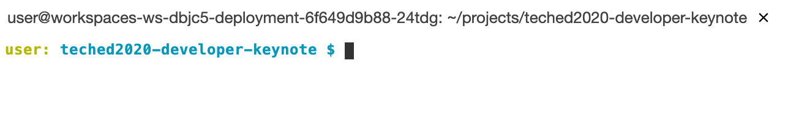

# The SANDBOX component

**Contents**
- [Overview](#overview)
- [Notes](#notes)
- [Configuration](#configuration)
- [Running the app](#running-the-app)
  - [Locally](#locally)
  - [On SAP Cloud Platform - CF runtime](#on-sap-cloud-platform---cf-runtime)


## Overview

The SANDBOX component is a small app that acts as a proxy in front of the SAP API Business Hub (API Hub) sandbox system. Because the app itself is small, we'll take the opportunity to explore different ways of running it, without having to worry too much about _what_ we're running. So here we'll explore running locally, on Cloud Foundry (CF) and on Kubernetes (k8s) with Kyma. In the Developer Keynote, this app is running in the Kyma runtime.

> The contents of this README assume that you've opted to use the SAP Business Application Studio (App Studio) as your [development environment](../../README.md#a-development-environment) and have followed the [App Studio setup instructions](../../usingappstudio.md).

The context in which it runs is shown as the highlighted section of the whiteboard:


Access to the API Hub sandbox system is protected; each and every call to it needs to have an API key specified in an HTTP header. That is what this app does - attach the API key to all requests during transit.

There are two APIs that are used on the sandbox system that the API Hub makes available for our use in the context of the Developer Keynote. Both are SAP S/4HANA Cloud APIs: [Sales Order (A2X)](https://api.sap.com/api/API_SALES_ORDER_SRV/resource) and [Business Partner (A2X)](https://api.sap.com/api/API_BUSINESS_PARTNER/resource).

There are two helper scripts in this directory that have been written to help you through the Docker related steps (the [`d`](d) script) and the Kyma / k8s related steps (the [`k`](k) script), and you can use them depending on the development environment setup that you have. In the context of the App Studio as your development environment, while you can use the `k` script for the Kyma / k8s tasks, you'll perform the Docker tasks using GitHub Actions features related to your forked GitHub repository rather than the `d` script. See the [note on Docker and App Studio](../../usingappstudio.md#a-note-on-docker-and-app-studio) for more details.

## Notes

Note that everything in this README is relative to this README's location in the repository, i.e. the `s4hana/sandbox/` directory:


Command line invocations shown here should also be made in the App Studio. To get ready, [make sure you have a terminal open and ready](usingappstudio.md#open-up-a-terminal), this should present you with a Bash shell prompt, something like this:



At this prompt, **move to the `s4hana/sandbox/` directory now**, like this:

```
user: teched2020-developer-keynote $ cd s4hana/sandbox/
user: sandbox $
```

> Alternatively, you can open a Terminal directly at the `s4hana/sandbox/` directory location by using the context menu on the `sandbox` directory node in the App Studio's Explorer and selecting "Open in Terminal".

As you can see here from what's displayed, the information before the `$` prompt shows you your username in the Dev Space ("user") and the last component part of your directory location ("sandbox").


## Configuration

The API key is unique to you and is available in the [preferences section](https://api.sap.com/preferences) of the API Hub. You'll need to specify it in two places, one for the Kyma runtime (k8s deployment) and one for the other environments.

1. Log on to the API Hub and grab your API key from the [preferences section](https://api.sap.com/preferences).

2. Replace `YOUR-API-KEY` in [`deployment.yaml`](deployment.yaml) with your API key - this is for the Kyma deployment

3. Also replace `YOUR-API-KEY` in [`router/default-env.json`](router/default-env.json) with your API key - this is for the local & CF execution

> Pay attention to the differences in quoting between the YAML and JSON files - the API key in the YAML file goes in raw, but in the JSON file it must be within double quotes.

Note that while editing these configuration files, you'll see another environment variable `destinations` - this is a quick way of defining simple destinations instead of setting them up at the subaccount or service instance level on SAP Cloud Platform. (The `destinations.json` file is an unused configuration file used when having a destination automatically defined on SAP Cloud Platform, and has been kept in this repo for reference.)

## Running the app

As mentioned earlier, you can run this app in a number of different contexts. We'll start with running locally, then look at a deployment to CF, and finally Kyma / k8s.

### Locally

You can run the app locally. Try this first. Move to the app's directory (`router/`), install the module dependencies, and then start the app up. Like this:

```
user: sandbox $ cd router/
user: router $ npm install
user: router $ npm start
```

You should see log output similar to this:

```
approuter@ start /Users/username/Projects/teched2020-developer-keynote/s4hana/sandbox/router
> node index.js

#2.0#2020 11 23 16:38:43:371#+00:00#WARNING#/LoggingLibrary################PLAIN##Dynamic log level switching not available#
#2.0#2020 11 23 16:38:43:585#+00:00#INFO#/approuter#####khuryg01##########khuryg01#PLAIN##Application router version 8.5.5#
#2.0#2020 11 23 16:38:43:589#+00:00#INFO#/Configuration#####khuryg05##########khuryg05#PLAIN##No COOKIES environment variable#
#2.0#2020 11 23 16:38:43:592#+00:00#WARNING#/Configuration#####khuryg08##########khuryg08#PLAIN##No authentication will be used when accessing backends. Scopes defined in routes will be ignored.#
#2.0#2020 11 23 16:38:43:592#+00:00#INFO#/Configuration#####khuryg08##########khuryg08#PLAIN##xs-app.json: Application does not have directory for static resources!#
#2.0#2020 11 23 16:38:43:593#+00:00#INFO#/Configuration#####khuryg08##########khuryg08#PLAIN##Replacing $XSAPPNAME will not take place - 'xsappname' property not found in UAA configuration.#
#2.0#2020 11 23 16:38:43:606#+00:00#INFO#/approuter#####khuryg01##########khuryg01#PLAIN##Application router is listening on port: 5000#
```

At this point, the app is running and listening for requests on port 5000. This is of course within the context of the App Studio's environment, which is not immediately available to you in your browser. So at this point, App Studio will pop up an "Expose and Open" message allowing you to have that port exposed to you.


> App Studio will only show this popup once once - if you restart the app, use the "Ports: Preview" command in App Studio's Command Palette (menu item "View -> Find Command") to access the feature again.

Once you opt for the "Expose and Open" feature, a new browser tab should open and you should see the `API_SALES_ORDER_SRV`'s service document. This is, then, the Sales Order (A2X) API on the API Hub's sandbox system, reversed proxied by the app you're now running.

When you've finished trying out the app locally (end it with Ctrl-C), **make sure you move back up a directory** to where this `README.md` file is:

```
user: router $ cd ..
user: sandbox $
```


### On SAP Cloud Platform - CF runtime

During the DK100 Developer Keynote demo itself, this app is run in the cloud, on SAP Cloud Platform, and specifically in the Kyma runtime. But you can also run it in the CF runtime, and this section is in case you want to do that.

Because of the simplicity of the app and the fact that it doesn't depend on anything else, we can use the simple `cf push` approach.

Before running the `cf push` command, make sure you're logged in and connected to your CF organization and space. Check what your CF API endpoint is from your SAP Cloud Platform Cockpit and issue the `cf login` command. The flow will look something like this (your API endpoint may be different):

```sh
$ cf login
API endpoint: https://api.cf.eu10.hana.ondemand.com

Email: sapdeveloper@example.com

Password:
Authenticating...
OK

Select an org:
1. 4dc50e9btrial
2. p123456789trial

Org (enter to skip): 1
Targeted org 4dc50e9btrial

Targeted space dev

API endpoint:   https://api.cf.eu10.hana.ondemand.com (API version: 3.88.0)
User:           sapdeveloper@example.com
Org:            4dc50e9btrial
Space:          dev
$
```

Here's what the `cf push` invocation looks like, and the sort of thing you should see (lots of output removed for readability):

```
$ cf push --random-route -p router proxyapp
Pushing app proxyapp to org 4dc50e9btrial / space dev as sapdeveloper@example.com...
Getting app info...
Creating app with these attributes...
+ name:       proxyapp
  path:       /Users/username/Projects/teched2020-developer-keynote/s4hana/sandbox/router
  routes:
+   proxyapp-wise-gnu-hc.cfapps.eu10.hana.ondemand.com

Creating app proxyapp...
Mapping routes...
Comparing local files to remote cache...
Packaging files to upload...
Uploading files...
...
Staging app and tracing logs...
   Downloading uas_dataflow_server_buildpack...
   Downloading ruby_buildpack...
   ...
   Exit status 0
   Uploading droplet, build artifacts cache...
   ...
   Uploading complete
   Cell f0e91f7f-390f-4ac0-9c81-28a3ae3c58cb stopping instance 4a89654f-6605-437c-bc76-c6d1f9bf63a4
   Cell f0e91f7f-390f-4ac0-9c81-28a3ae3c58cb destroying container for instance 4a89654f-6605-437c-bc76-c6d1f9bf63a4
   Cell f0e91f7f-390f-4ac0-9c81-28a3ae3c58cb successfully destroyed container for instance 4a89654f-6605-437c-bc76-c6d1f9bf63a4

Waiting for app to start...

name:                proxyapp
requested state:     started
isolation segment:   trial
routes:              proxyapp-wise-gnu-hc.cfapps.eu10.hana.ondemand.com
last uploaded:       Tue 24 Nov 10:18:22 GMT 2020
stack:               cflinuxfs3
buildpacks:          nodejs

type:            web
instances:       1/1
memory usage:    1024M
start command:   npm start
     state     since                  cpu    memory    disk      details
#0   running   2020-11-24T10:18:36Z   0.0%   0 of 1G   0 of 1G
```

In the output, the route is shown, and you can check that you can access the `API_SALES_ORDER_SRV`'s service document again, at the URL relating to the route URL. In this case, it is:

`https://proxyapp-wise-gnu-hc.cfapps.eu10.hana.ondemand.com/sap/opu/odata/sap/API_SALES_ORDER_SRV/`

Your URL will be different, mostly because of the use of the `--random-route` switch. You should see the service document served to you again, but this time, via the proxy app running in the CF environment on SAP Cloud Platform.

> In case you prefer the Multi Target Application (MTA) approach, there's an `mta.yaml` file in this directory too, so you can use the build-and-deploy approach if you really want to, like this (a reduced sample output is also shown):

```
$ mbt build && cf deploy mta_archives/s4-mock_1.0.0.mtar
[2020-11-24 11:03:38]  INFO Cloud MTA Build Tool version 1.0.16
[2020-11-24 11:03:38]  INFO generating the "Makefile_20201124110338.mta" file...
[2020-11-24 11:03:38]  INFO done
[2020-11-24 11:03:38]  INFO executing the "make -f Makefile_20201124110338.mta p=cf mtar= strict=true mode=" command...
[2020-11-24 11:03:38]  INFO validating the MTA project
[2020-11-24 11:03:38]  INFO validating the MTA project
[2020-11-24 11:03:38]  INFO building the "proxyapp" module...
[2020-11-24 11:03:38]  INFO executing the "npm install --production" command...
...
[2020-11-24 11:03:41]  INFO finished building the "proxyapp" module
[2020-11-24 11:03:41]  INFO generating the metadata...
[2020-11-24 11:03:41]  INFO generating the "/Users/username/Projects/teched2020-developer-keynote/s4hana/sandbox/.sandbox_mta_build_tmp/META-INF/mtad.yaml" file...
[2020-11-24 11:03:41]  INFO generating the MTA archive...
[2020-11-24 11:03:41]  INFO the MTA archive generated at: /Users/username/Projects/teched2020-developer-keynote/s4hana/sandbox/mta_archives/s4-mock_1.0.0.mtar
[2020-11-24 11:03:41]  INFO cleaning temporary files...
...
Application "proxyapp" started and available at "4dc50e9btrial-dev-proxyapp.cfapps.eu10.hana.ondemand.com"
Process finished.
```

In this example, the `API_SALES_ORDER_SRV`'s service document would be available at:

`https://4dc50e9btrial-dev-proxyapp.cfapps.eu10.hana.ondemand.com/sap/opu/odata/sap/API_SALES_ORDER_SRV/`


### On SAP Cloud Platform - Kyma runtime

There are a number of steps to get the app running in Kyma, i.e. on k8s:

- build a Docker image for the app
- publish the image to a container registry
- create a k8s secret for registry access
- make a deployment to Kyma

If you've gone through the process of running the app locally in a Docker container, as described earlier, you're already part way there.

#### Build a Docker image

In case you haven't, the first thing you need to do is to create a Docker image of this app and its environment. Do this by invoking the `d` script with the "build" action, as described in the "Locally in a Docker container" section earlier (essentially, like this: `$ ./d build`). This then is the "package" that is then published and gets run in k8s once the deployment process is complete.


#### Publish the image to a container registry

The reason this step is required is because we want to get Kyma to pull the image from a container registry. We use the GitHub Packages Docker container registry in our session, and you can too. In the GitHub documentation article [Configuring Docker for use with GitHub Packages](https://docs.github.com/en/free-pro-team@latest/packages/using-github-packages-with-your-projects-ecosystem/configuring-docker-for-use-with-github-packages) there's a section on [Authenticating to GitHub Packages](https://docs.github.com/en/free-pro-team@latest/packages/using-github-packages-with-your-projects-ecosystem/configuring-docker-for-use-with-github-packages#authenticating-to-github-packages) which describes how you need to create a personal access token to use as a password in authentication flows. Do this now.

> Once you have a person access token (with the appropriate scopes) you can publish your Docker image to your GitHub account.

First, authenticate yourself with the registry, using the "login" action of the `d` script:

```
$ ./d login
Authenticating with GitHub Packages
Enter username: <YOUR GITHUB ORG/USERNAME>
Enter password / token: <ACCESS TOKEN>
Login Succeeded
```

Now you can publish the image, using the "publish" action of the `d` script, and you should see something similar to what's shown here:

```
$ ./d publish
Publishing image to GitHub Packages
The push refers to repository [docker.pkg.github.com/sap-samples/teched2020-developer-keynote/s4mock]
...
latest: digest: sha256:58870f6f89546548d6ee290cab89850a763c7c66faa93a2373bf1cf9385ec954 size: 3054
```

You can check in your own GitHub repository that this has been successful - check in your repository's Packages section (look on the right of your repository's home page on GitHub). You should see the `s4mock` package listed, as it is in [this repository's Packages section](https://github.com/orgs/SAP-samples/packages?repo_name=teched2020-developer-keynote):


> Other packages are shown in this screenshot too - they're from other components in this repository.

#### Create a k8s secret for registry access

You had to authenticate to the container registry before publishing the image there; so too must the runtime (k8s) authenticate to be able to retrieve it. So in this step you need to store the container registry credentials so that they can be used by the runtime platform.

> You must be first authenticated with your Kyma runtime on SAP Cloud Platform for this step.

A typical incantation to create such a secret looks like this:

```
kubectl create secret docker-registry regcred --docker-server=https://docker.pkg.github.com --docker-username=<YOUR GITHUB ORG/USERNAME> --docker-password=<ACCESS TOKEN> --docker-email=<YOUR GITHUB EMAIL>
```

This has been also made available as an action in another script: [`k`](k):

```shell
$ ./k
Usage: k <action>
where <action> is one of:
- deploy: make deployment
- secret: create secret for GitHub Package registry access
```

Create the secret like this:

```shell
$ ./k secret
Setting up docker-registry secret regcred for access to https://docker.pkg.github.com
Secret regcred exists - will remove first (hit enter to continue)
secret "regcred" deleted
Enter email: <YOUR GITHUB EMAIL>
Enter username: <YOUR GITHUB ORG/USERNAME>
Enter password / token: <ACCESS TOKEN>
secret/regcred created
```

> If there already is a secret of the same name you'll be prompted to have it deleted first, as shown in this example output.

You can check that the secret has been created, thus:

```shell
$ kubectl get secrets
NAME                              TYPE                                  DATA   AGE
regcred                           kubernetes.io/dockerconfigjson        1      109s
...
```

#### Make a deployment to Kyma

Now everything is ready to make a deployment to the Kyma runtime. The deployment is described in the `deployment.yaml` file, which includes a reference to the Docker image you've just published to the container registry. It will be retrieved using the secret you just created.

The deployment is quite simple at this stage (as you can see from the `deploy` function in the [`k`](k) script). Invoke it with the "deploy" action thus:

```shell
 ./k deploy
Deploying to k8s
configmap/appconfig created
deployment.apps/s4mock created
service/s4mock created
apirule.gateway.kyma-project.io/s4mock created
```

The app is now deployed to the Kyma runtime in your SAP Cloud Platform subaccount.

Just like before, you can check that it's working by requesting the API's service document. You'll need first to find out what the first part of the URL is.

Visit the Kyma console (get there from your trial subaccount overview page and use the "Link to dashboard" link), select the "default" namespace, and in the "Configuration > API Rules" section, you'll see the relevant URL:


Open up that URL. You'll noticed that you get redirected to `/sap/opu/odata/sap/API_SALES_ORDER_SRV/` - you should now see your old friend the API's service document.
