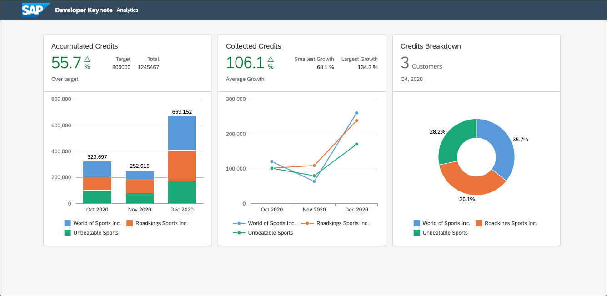
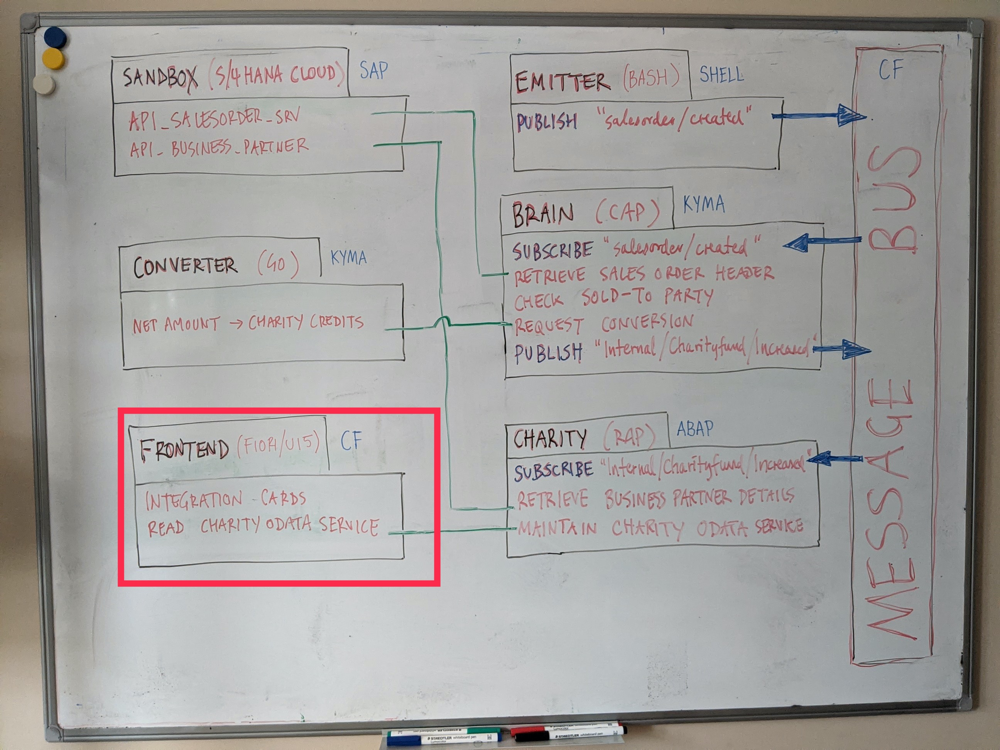

# Web Dashboard

This is a SAPUI5 app represents the dashboard of the project. It visualizes the charity data from the RAP charity service with [UI Integration Cards](https://ui5.sap.com/test-resources/sap/ui/integration/demokit/cardExplorer/index.html).




## Overview

The context in which it runs is shown as the highlighted section of the whiteboard:



## Running the app locally

### With sample data

1. Install deps `npm install` 
2. Replace the first route in the `xs-app.json` with
    ```
    {
      "source": "^/sap/credits",
      "target": "/credits.json",
      "localDir": "sample"
    }
    ```
3. Run Approuter `npm start`
4. Access <http://localhost:5000/> to test the integration cards


## Deploy to SAP Cloud Platform

Prior to any deployment, create a destination named `rap` in the SAP Cloud Platform cockpit. This destination shall point to the RAP Charity Rest service and specify the applied authentication parameters. Make sure to use the right autentication type:


1. [Subscribe to the Launchpad service](https://developers.sap.com/tutorials/cp-portal-cloud-foundry-getting-started.html)
2. Build the project with `mbt build`
3. Deploy with `cf deploy mta_archives/developer-keynote-dashboard_1.0.0.mtar`
4. Run the following command to print the URL of the web app `cf html5-list -di developer-keynote-dashboard-destination-service -u`. Note that you need to replace `cpp` with `launchpad` before accessing it.


