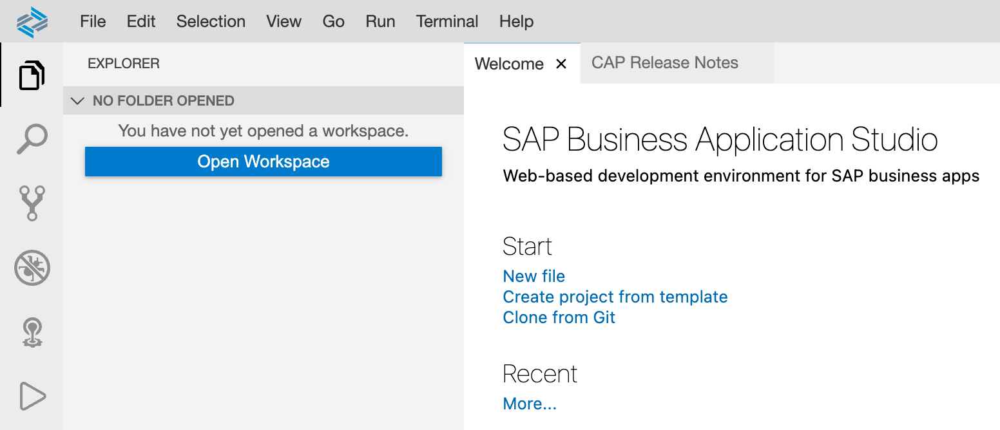
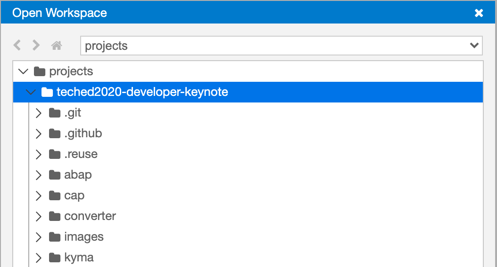

# Using the SAP Business Application Studio

**Contents**
- [Overview](#overview)
- [Perform initial setup](#perform-initial-setup)
- [Create a Dev Space](#create-a-dev-space)
- [Clone your fork of this repository](#clone-your-fork-of-this-repository)
- [Open up a Terminal](#open-up-a-terminal)

## Overview

We don't want to dictate which tools or environments to use, but also don't want to leave you stranded if you can't decide or are unable to install tools locally.

The aim here is to make sure you can dig into and get your hands dirty with all of the components in this Developer Keynote repository using the SAP Business Application Studio (App Studio), if that's what you want to do.

The [App Studio](https://help.sap.com/viewer/product/SAP%20Business%20Application%20Studio/Cloud/en-US) is available to everyone with a trial account on SAP Cloud Platform, and provides a very comfortable working environment with a familiar IDE paradigm, a wealth of plugins and extensions, and access to a terminal for using command line tools.

Follow the instructions here to get ready.

## Perform initial setup

To set yourself you with the App Studio, first follow the [Set Up SAP Business Application Studio for Development](https://developers.sap.com/tutorials/appstudio-onboarding.html) tutorial.

## Create a Dev Space

Think of a Dev Space as an instance of the (cloud-based) App Studio set up with specific tools and extensions suitable for development of a certain kind.

At the end of the tutorial mentioned earlier, you'll see the option to create a Dev Space. Do that now, and from the choice of Dev Space types, which are essentially collections of tools and extensions, **choose the "SAP Cloud Business Application" type**. Most significantly, this Dev Space type comes with SAP Cloud Application Programming Model (CAP) tools in the form of the "CDS Tools" extension, and tools for managing Multi-Target Applications (MTAs), in the form of the "MTA Tools" extension.

Creation of the Dev Space will take a few moments; once you see the "RUNNING" status you can connect to it.

## Clone your fork of this repository

In the [Download and installation](README.md#download-and-installation) section of this repository's main README, you'll see that you must fork this repository into your own user or organization space on GitHub, and then clone that fork.

Assuming that you've already forked the repository, now would be a good time to clone that fork. In other words, to make a local copy of *your fork* of this repository.

> Let's assume that your GitHub username is "sapdeveloper" - this name will be used in the subsequent examples; make sure you substitute your own username when carrying out the instructions.

In your Dev Space, on the Welcome page, use the "Clone from Git" option.



Follow the prompts to specify the Web URL for your clone, which will be something like this:

`https://github.com/sapdeveloper/teched2020-developer-keynote.git`

You should see some output in the Git pane along these lines:

```
user: user $ git clone https://github.com/sapdeveloper/teched2020-developer-keynote $HOME/projects/teched2020-developer-keynote/
Cloning into '/home/user/projects/teched2020-developer-keynote'...
remote: Enumerating objects: 184, done.
remote: Counting objects: 100% (184/184), done.
remote: Compressing objects: 100% (107/107), done.
remote: Total 2168 (delta 91), reused 90 (delta 43), pack-reused 1984
Receiving objects: 100% (2168/2168), 18.79 MiB | 11.15 MiB/s, done.
Resolving deltas: 100% (1009/1009), done.
user: user $
```

Now use the "Open Workspace" facility to open up a workspace pointing to the newly created `teched2020-developer-keynote` directory; select the directory as shown:



The Dev Space will restart and you should see the contents of your cloned repository in the Explorer view.

## Open up a Terminal

You'll be using commands in the shell when setting up some components in this repository, so you might as well open up a Terminal in your Dev Space right now. You can do this by using the menu path "Terminal -> New Terminal", or using the "Terminal: Open New Terminal" via the Command Palette, or simply with the keyboard shortcut Ctrl-`.


