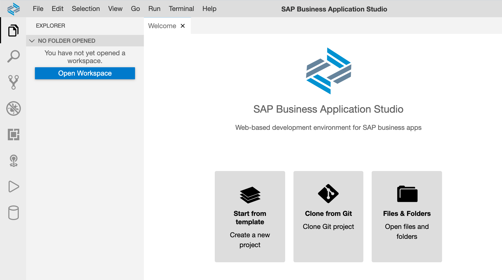
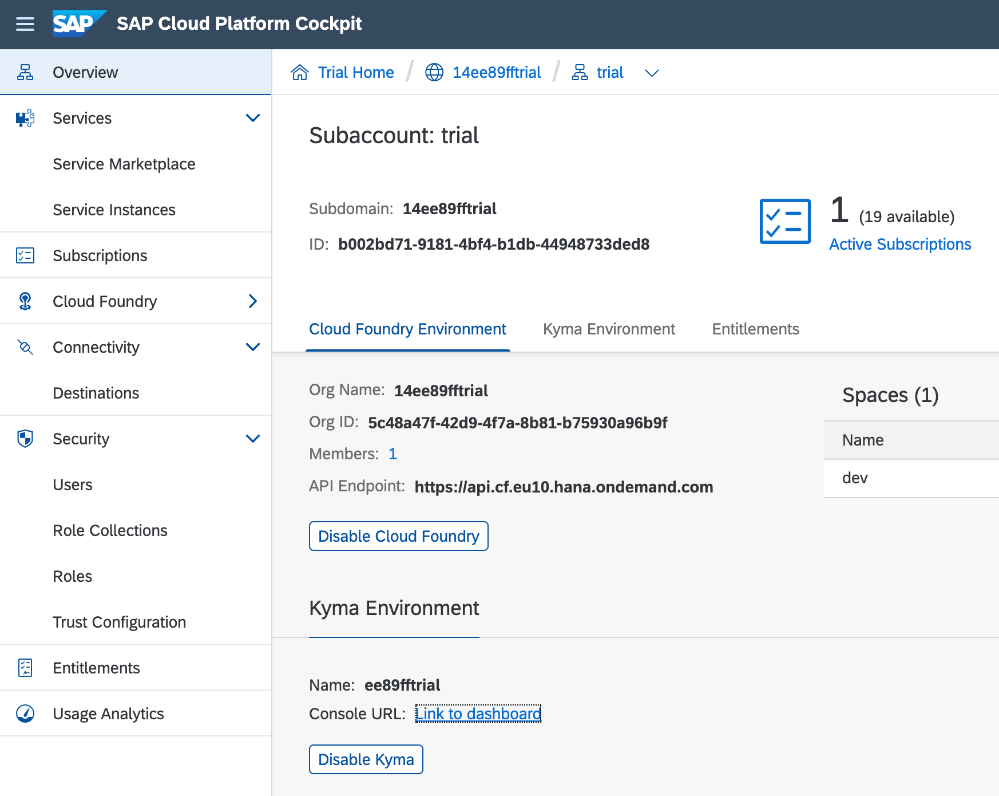

# Using the SAP Business Application Studio

**Contents**
- [Overview](#overview)
  - [A note on Docker and App Studio](#a-note-on-docker-and-app-studio)
- [Perform initial setup](#perform-initial-setup)
- [Create a Dev Space](#create-a-dev-space)
- [Clone your fork of this repository](#clone-your-fork-of-this-repository)
- [Open up a terminal](#open-up-a-terminal)
- [Add tools to your Dev Space](#add-tools-to-your-dev-space)
- [Set up the Kyma runtime configuration](#set-up-the-kyma-runtime-configuration)

## Overview

We don't want to dictate which tools or environments to use, but also don't want to leave you stranded if you can't decide or are unable to install tools locally.

The aim here is to make sure you can dig into and get your hands dirty with all of the components in this Developer Keynote repository using the SAP Business Application Studio (App Studio), if that's what you want to do.

The [App Studio](https://help.sap.com/viewer/product/SAP%20Business%20Application%20Studio/Cloud/en-US) is available to everyone with a trial account on SAP Cloud Platform, and provides a very comfortable working environment with a familiar IDE paradigm, a wealth of plugins and extensions, and access to a terminal for using command line tools.

Follow the instructions here to get ready.

### A note on Docker and App Studio

Note that App Studio doesn't give you a Docker engine - you won't be able to directly build images, for example, in the context of a Dev Space. However, there are other ways to get images built and published (which is what's required for some of the components in this repository, for eventual deployment to and execution in the Kyma / Kubernetes environment).

Where Docker images need to be built, we'll be using facilities provided by GitHub, in the context of your own forked version of this repository. This is partly why we've insisted you fork this repository before starting (the other, main reason being that you get to store Docker images in the [GitHub Package Repository](https://github.com/features/packages) facilities connected to your own repository).

The Docker facilities in GitHub come in the form of actions & command line invocations that can be carried out in the context of jobs, using [GitHub Actions](https://github.com/features/actions). Jobs are defined in so-called "workflows", and are available in the Actions section of the repository. Note that you'll have to [enable workflows on your forked repository](../enabling-workflows.md).

If you choose to use and manage your own development environment, and have access to Docker, you are of course more than welcome to use Docker locally.

## Perform initial setup

To set yourself you with the App Studio, first follow the [Set Up SAP Business Application Studio for Development](https://developers.sap.com/tutorials/appstudio-onboarding.html) tutorial.

## Create a Dev Space

Think of a Dev Space as an instance of the (cloud-based) App Studio set up with specific tools and extensions suitable for development of a certain kind.

At the end of the tutorial mentioned earlier, you'll see the option to create a Dev Space. Do that now, and from the choice of Dev Space types, which are essentially collections of tools and extensions, **choose the "SAP Cloud Business Application" type**. Most significantly, this Dev Space type comes with SAP Cloud Application Programming Model (CAP) tools in the form of the "CDS Tools" extension, and tools for managing Multi-Target Applications (MTAs), in the form of the "MTA Tools" extension.

Creation of the Dev Space will take a few moments; once you see the "RUNNING" status you can connect to it.

## Clone your fork of this repository

In the [Download and installation](README.md#download-and-installation) section of this repository's main README, you'll see that you must fork this repository into your own user or organization space on GitHub, and then clone that fork.

Assuming that you've already forked the repository (you would normally do this on the GitHub website, using the "Fork" button in the top right), now would be a good time to clone that fork. In other words, to make a local copy of *your fork* of this repository.

> Let's assume that your GitHub username is "sapdeveloper" - this name will be used in the subsequent examples; make sure you substitute your own username when carrying out the instructions.

In your Dev Space, on the Welcome page, use the "Clone from Git" option.



Follow the prompts to specify the Web URL for your clone, which will be something like this:

`https://github.com/sapdeveloper/teched2020-developer-keynote.git`

You should see some output in the Git pane along these lines:

```
user: user $ git clone https://github.com/sapdeveloper/teched2020-developer-keynote $HOME/projects/teched2020-developer-keynote/
Cloning into '/home/user/projects/teched2020-developer-keynote'...
remote: Enumerating objects: 184, done.
remote: Counting objects: 100% (184/184), done.
remote: Compressing objects: 100% (107/107), done.
remote: Total 2168 (delta 91), reused 90 (delta 43), pack-reused 1984
Receiving objects: 100% (2168/2168), 18.79 MiB | 11.15 MiB/s, done.
Resolving deltas: 100% (1009/1009), done.
user: user $
```

Now use the "Open Workspace" facility to open up a workspace pointing to the newly created `teched2020-developer-keynote` directory; select the directory as shown:


The Dev Space will restart and you should see the contents of your cloned repository in the Explorer view.

## Open up a terminal

You'll be using commands in the shell when setting up some components in this repository, and you'll certainly be needing one for the next step in this Dev Space setup, so it's time to open up a terminal in your Dev Space right now.

Do this by using the menu path "Terminal -> New Terminal", or using the "Terminal: Open New Terminal" via the Command Palette, or simply with the keyboard shortcut Ctrl-`.

## Add tools to your Dev Space

Depending on the type of Dev Space you set up, you'll already have access to some command line tools in the shell. The type of Dev Space you've specified in these instructions makes available the Cloud Foundry (CF) `cf` tool, for example. You can try it out now, by entering the command at the prompt:

```
user: teched2020-developer-keynote $ cf
```

You should see some help summarizing what you can do with that command.

It's possible that some activities might require the use of tools that are not installed by default - the setting up of some of the components in this repository is one example, where tools such as [`jq`](https://stedolan.github.io/jq/) are needed. We've provided a setup script that you can run in the terminal that will install these tools for you.

At the prompt, move to this `usingappstudio/` directory, and then invoke the [`appstudiosetup`](appstudiosetup) script, which will install various tools for you:

```
user: teched2020-developer-keynote $ cd usingappstudio/
user: usingappstudio $ ./appstudiosetup
Installing yq ...
Installing jq ...
Please now restart the terminal (Ctrl-D then Ctrl-`) to have the new shell settings take effect.
```

As instructed, restart the terminal, and you're all set!

> The reason for restarting the terminal is so that the shell environment will be restarted, which will in turn means that the `.bashrc` file that sets up various things will be invoked again. We want this to happen because the `appstudiosetup` script has inserted a line into `.bashrc` to add a local directory to the `PATH` environment variable, so that the newly installed tools are available to run directly (if you're interested, it's the `setup()` function in `appstudiosetup` that does this).

## Set up the Kyma runtime configuration

To interact with Kyma, you can use the dashboard, which will be linked from your trial subaccount on SAP Cloud Platform, as shown:



You can also use the `kubectl` command line tool. This tool is automatically installed into your Dev Space with the `appstudiosetup` script mentioned in an earlier section, but in order to use it, or rather connect it to your specific Kyma environment, you need to download the configuration known as "kubeconfig", and ensure that your `kubectl` tool knows where to find that configuration.

You download the "kubeconfig" configuration as a file, from the Kyma dashboard, and then tell `kubectl` where it is via the special environment variable `KUBECONFIG`. In the SAP Developers tutorial [Install the Kubernetes Command Line Tool](https://developers.sap.com/tutorials/cp-kyma-download-cli.html) this process is described generally in the last two steps ("Download the Kyma runtime kubeconfig" and "Set the KUBECONFIG environment variable"). This is what we need to do now, but in the context of your Dev Space.

Downloading the "kubeconfig" configuration will result in a `kubeconfig.yml` file being placed in your local filesystem. Upload this to your Dev Space's workspace, specifically to the root i.e. the `projects/teched2020-developer-keynote/` directory. You can do this simply by selecting the file in your file system and dragging it to the Explorer part of your Dev Space, ensuring you drag it into the right place.

> The "kubeconfig" based credentials expire after a certain amount of time; you'll notice because you'll see a message like this: "error: You must be logged into the server (the server has asked for the client to provide credentials)". When this happens, simply repeat the download / upload process here.

Once you've done that, you're all set - the [`appstudiosetup`](appstudiosetup) script has already set the `KUBECONFIG` environment variable for you, by inserting a line like this into your `.bashrc` file:

```sh
export KUBECONFIG=$HOME/projects/teched2020-developer-keynote/kubeconfig.yml
```

You should now be able to query your Kyma runtime. Try a simple request, and you should see some output indicating a successful authentication with and connection to your runtime:

```
user: teched2020-developer-keynote $ kubectl get namespaces
NAME               STATUS   AGE
compass-system     Active   2d23h
default            Active   3d
istio-system       Active   3d
knative-eventing   Active   3d
kube-node-lease    Active   3d
kube-public        Active   3d
kube-system        Active   3d
kyma-installer     Active   3d
kyma-integration   Active   2d23h
kyma-system        Active   3d
natss              Active   3d
```
